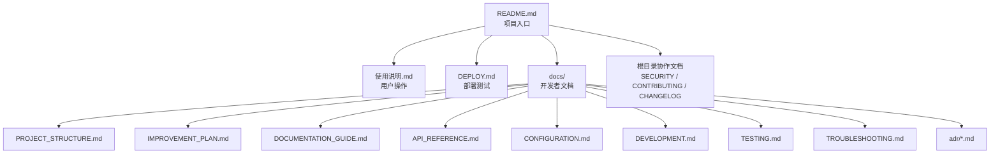

# OpsDog 文档地图与维护规范

最后核对日期：2026-05-19

本文说明 OpsDog 项目应该保留哪些文档、每份文档解决什么问题、什么时候必须更新。目标是让文档成为开发流程的一部分，而不是交付前临时补材料。

## 1. 文档分层



## 2. 当前已建立的文档

| 文档 | 读者 | 作用 | 维护时机 |
| --- | --- | --- | --- |
| `README.md` | 所有人 | 项目简介、快速启动、文档入口 | 文档入口、启动命令或项目定位变化 |
| `DEPLOY.md` | 测试/交付/开发 | 运行环境、部署启动、排障 | 端口、依赖、打包规则、系统要求变化 |
| `使用说明.md` | 最终使用者/测试 | 工作区和功能操作说明 | UI 工作区、操作流程、状态含义变化 |
| `docs/PROJECT_STRUCTURE.md` | 开发者 | 项目结构、架构图、核心链路、模块边界 | 新增模块、移动目录、改变关键数据流 |
| `docs/IMPROVEMENT_PLAN.md` | 开发者/维护者 | 当前问题、风险、改进优先级 | 完成一批改进后更新状态和下一步 |
| `docs/DOCUMENTATION_GUIDE.md` | 开发者/维护者 | 文档体系、维护规则、后续文档规划 | 文档规范变化 |
| `docs/adr/0000-template.md` | 开发者/维护者 | 架构决策记录模板 | ADR 格式变化 |

## 3. 还需要补齐的文档

### 3.1 `docs/API_REFERENCE.md`

读者：前端开发、后端开发、测试。

应该包含：

- API 分组：健康、模型、MCP、Server、Skill、Workflow、资产、报告。
- 每个接口的方法、路径、用途、请求体、响应体、错误码。
- 前端调用入口，例如对应 `webRuntime.ts` 的哪个方法。
- 典型 curl 示例，避免依赖 UI 才能调试。

维护时机：

- 新增、删除或修改 `/api/*` 路由。
- 请求/响应字段变化。
- 错误模型变化。

### 3.2 `docs/CONFIGURATION.md`

读者：开发、测试、部署人员。

应该包含：

- `.env.example` 每个变量的含义和示例。
- 哪些变量只给前端用，哪些只给后端用。
- `VITE_*` 会暴露到浏览器，不能放密钥。
- 本地开发、内网测试、交付包三种配置方式。
- 语音、工单、资产远端接口、MCP env 的安全边界。

维护时机：

- 新增环境变量。
- 默认端口变化。
- 新增外部集成。
- 改变打包或部署规则。

### 3.3 `docs/DEVELOPMENT.md`

读者：后续开发者。

应该包含：

- 本地开发流程。
- 常用命令。
- 代码风格和模块边界。
- 如何新增即时脚本、托管脚本、Skill、MCP、Workflow、报告能力。
- 如何调试前端 runtime、后端 API、Python 子进程、MCP 连接。
- 提交前检查清单。

维护时机：

- 新增开发工具。
- 模块边界调整。
- 新增一类可扩展能力。

### 3.4 `docs/TESTING.md`

读者：开发、测试、交付。

应该包含：

- 测试分层：单元、接口、E2E、打包验收。
- 每层测试命令和运行前提。
- 核心验收场景：
  - 首页和工作区加载。
  - 后端健康检查。
  - MCP 列表和连接。
  - Skill 扫描和执行。
  - 托管任务启动/停止/恢复。
  - 资产状态合并。
  - 报告生成和下载。
  - 工单 payload 预览。
- Windows/macOS/Linux 差异检查。

维护时机：

- 新增测试工具。
- 新增关键业务链路。
- 打包规则变化。

### 3.5 `docs/TROUBLESHOOTING.md`

读者：测试、交付、开发。

应该包含：

- 端口占用。
- 后端未连接。
- Vite 代理失败。
- Python 不在 PATH。
- MCP Server 启动失败。
- DXT/MCPB 导入失败。
- filesystem MCP 根目录异常。
- 资产接口失败。
- ping 或 TCP 检测异常。
- 工单系统返回错误。
- PDF 报告生成失败。
- Windows PowerShell 注意事项。

维护时机：

- 新增常见错误。
- 修复一个高频故障后，把根因和处理步骤写入。

### 3.6 `SECURITY.md`

读者：开发、维护者、测试方。

应该包含：

- 如何报告安全问题。
- 密钥、token、API Key、客户数据的处理规则。
- `.env`、`server/data`、历史报告、工单记录的入库规则。
- CORS、MCP 风险级别、自动工具调用的安全约束。
- 打包前的泄漏检查。

维护时机：

- 新增外部集成。
- 新增敏感数据类型。
- 改变 MCP 风险策略或确认机制。

### 3.7 `CONTRIBUTING.md`

读者：协作者和后续开发者。

应该包含：

- 分支命名和提交信息约定。
- PR 检查项。
- 代码、测试、文档同步要求。
- 如何处理已有未提交运行态数据。
- 不要提交 `.env`、`node_modules`、历史报告、机器相关 server 配置。

维护时机：

- 团队协作规则变化。
- 新增 CI 或代码检查工具。

### 3.8 `CHANGELOG.md`

读者：开发、测试、交付。

应该包含：

- 每个版本或交付包的变更摘要。
- 新增、修复、变更、移除、已知问题。
- 打包文件名和验证结果。

维护时机：

- 每次生成交付包。
- 每次合并一组对用户或部署有影响的改动。

### 3.9 `docs/adr/*.md`

读者：开发者和维护者。

应该包含：

- 一次重要技术决策的上下文、选项、决策、后果和验证方式。

适合写 ADR 的情况：

- 有多个合理方案，且后续维护者需要知道为什么选择当前方案。
- 引入新框架、新协议、新持久化方式、新部署方式。
- 改变 MCP、Skill、资产、工单、报告等核心概念边界。

## 4. 文档维护规则

| 代码变化 | 必须更新的文档 |
| --- | --- |
| 新增或修改 `/api/*` 路由 | `docs/API_REFERENCE.md`、必要时 `docs/PROJECT_STRUCTURE.md` |
| 新增环境变量 | `.env.example`、`docs/CONFIGURATION.md`、必要时 `DEPLOY.md` |
| 新增脚本/Skill/MCP/Workflow | `docs/DEVELOPMENT.md`、必要时 `使用说明.md` |
| 改变目录结构或模块边界 | `docs/PROJECT_STRUCTURE.md` |
| 改变部署方式或系统依赖 | `DEPLOY.md`、`docs/TROUBLESHOOTING.md` |
| 修复高频故障 | `docs/TROUBLESHOOTING.md` |
| 改变密钥、CORS、风险控制 | `SECURITY.md`、`docs/CONFIGURATION.md` |
| 产生交付包 | `CHANGELOG.md`、`DEPLOY.md` 如有变化 |
| 做出重要技术取舍 | 新增一篇 ADR |

## 5. 文档写作约定

- 中文优先，面向开发者时可以保留必要英文术语。
- 每份文档开头写清读者和用途。
- 命令必须可直接复制执行。
- 路径、环境变量、API 名称使用反引号。
- 图使用 Mermaid，便于在 GitHub 和多数 Markdown 工具中渲染。
- 不在文档中写真实密钥、真实客户数据、内网凭据。
- 文档中示例域名使用 `example.com` 或明确占位符。
- 不把长篇架构细节放在 README；README 只做入口。

## 6. 新文档模板

```markdown
# 标题

最后核对日期：YYYY-MM-DD

读者：

目标：

## 背景

## 当前行为

## 操作步骤或接口说明

## 常见问题

## 相关文件
```

## 7. Mermaid 使用建议

适合使用 Mermaid 的地方：

- 系统上下文：`flowchart LR`
- 模块关系：`flowchart TB`
- 请求链路：`sequenceDiagram`
- 状态机：`stateDiagram-v2`
- 改进路线：`gantt`

注意事项：

- 节点文字尽量短。
- 中文、标点和路径较多时，用引号包住节点标签。
- 图只表达主路径，不要把所有异常分支塞进一张图。

## 8. 文档完成定义

一份文档完成前至少检查：

- 路径存在或明确标注为计划新增。
- 命令能在当前项目中找到。
- API 路径与 `server/src/index.js` 一致。
- 端口与 `.env.example`、`DEPLOY.md` 一致。
- 没有真实密钥、内网敏感地址、个人本机路径。
- Mermaid 代码块有语言标记。
- README 中能找到文档入口。

## 9. 外部参考

- GitHub 仓库文档建议：<https://docs.github.com/en/enterprise-cloud%40latest/repositories/creating-and-managing-repositories/best-practices-for-repositories>
- Vite 环境变量说明：<https://vite.dev/guide/env-and-mode.html>
- React Effect 指南：<https://react.dev/learn/separating-events-from-effects>
- Zustand persist：<https://zustand.site/en/docs/persist/>
- ADR 参考：<https://github.com/architecture-decision-record/architecture-decision-record>
