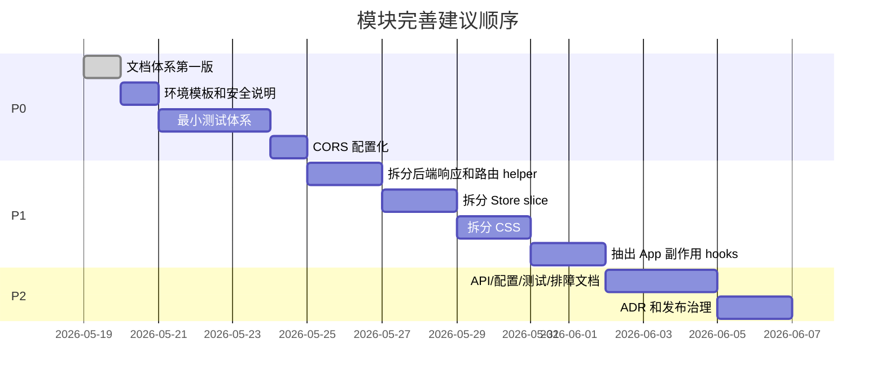

# OpsDog 当前问题与改进建议

最后核对日期：2026-05-19

本文只描述当前模块完善建议，不规划新功能。目标是降低后续开发成本、提升交付可靠性、减少配置和运行态风险。

## 1. 结论摘要

当前项目已经形成完整的 Web-first 工作台链路，但还处在“功能快速集成后”的形态：主干能力可运行，模块边界和文档正在补齐，测试、路由分层、安全配置、运行态治理仍需要系统化完善。

优先级建议：

| 优先级 | 目标 | 代表问题 |
| --- | --- | --- |
| P0 | 交付可靠性和安全底线 | 测试缺口、环境模板含内部地址、CORS 过宽、密钥边界不清 |
| P1 | 代码可维护性 | 大文件职责过重、API 路由集中、Store/CSS 混杂 |
| P2 | 工程治理 | API 文档、ADR、发布记录、日志审计、文档同步 |

## 2. 事实依据

只读扫描得到的当前信号：

| 证据 | 说明 |
| --- | --- |
| `src/index.css` 约 6447 行 | 全局样式集中，后续 UI 变更容易互相影响 |
| `server/src/index.js` 约 1742 行 | HTTP 路由、模型、MCP、资产、报告、工单、工具函数集中 |
| `server/src/serverRegistry.js` 约 1041 行 | 系统 Server、脚本 Server、Skill 兼容解析和修复逻辑集中 |
| `src/stores/index.ts` 约 765 行 | AppState、ChatState、配置快照、持久化触发混在一起 |
| 未发现常规 `*.test.*` / `*.spec.*` 文件 | 当前缺少单元、集成、E2E 测试体系 |
| `server/src/index.js` 多处 `Access-Control-Allow-Origin: *` | 开发方便，但交付环境应配置化 |
| `.env.example` 含内部工单 URL 和内网资产 IP 示例 | 对外测试包和仓库模板存在信息泄露/误配置风险 |
| `/api/*` 路由集中在 `server/src/index.js` | 缺少路由分层、统一输入校验、统一错误模型 |

## 3. P0：先补交付可靠性和安全底线

### 3.1 建立最小测试体系

问题：

- 当前没有发现单元测试、接口测试、组件测试或 E2E 测试。
- 只有 `scripts/package-test-bundle.mjs` 这类打包脚本，不能证明核心链路没有回归。
- MCP、Skill、托管任务、资产状态、报告/工单都属于高耦合链路，没有测试保护时，后续完善模块风险较高。

影响：

- 修改 `server/src/index.js` 或 runtime 时，可能破坏多条 `/api/*` 链路。
- 修改 `stores/index.ts` 时，可能导致配置、会话、技能启用状态恢复异常。
- 修改设备检测、报告、工单时，缺少自动验收。

建议：

- 引入 Vitest，优先覆盖纯函数和服务层：
  - `src/services/skillsMatcher.ts`
  - `src/services/runtime/mcpChatPlanner.ts`
  - `src/services/persistence.ts` 的 normalize 逻辑
  - `server/src/serverRegistry.js` 的路径修复和 server 定义生成
  - `server/src/mcpRegistry.js` 的配置规范化
- 增加后端接口集成测试，覆盖：
  - `GET /api/health`
  - `GET /api/servers`
  - `GET /api/skills`
  - `GET /api/mcp/servers`
  - `GET /api/assets/merged`
- 增加 Playwright 冒烟测试：
  - 启动前后端。
  - 打开首页。
  - 验证后端在线状态。
  - 切换对话、任务、设备、总览工作区。
  - 确认没有空白页和关键控制台错误。

验收标准：

- `npm test` 或等效命令可本地运行。
- 至少覆盖核心纯函数、基础 API 和工作区加载。
- CI 或手动发布清单中必须运行构建和测试。

### 3.2 清理 `.env.example` 的内部地址和敏感示例

问题：

- `.env.example` 当前包含真实业务域名样式的工单 URL 示例。
- `.env.example` 当前包含内网资产接口 IP 示例。
- `TICKETING_API_KEY=自己的的KEY` 虽然是占位，但仍建议统一占位格式。
- `VITE_ALERT_VOICE_NOTIFY_ENABLED=true` 这类前端开关容易让读者误以为前端 env 可以安全控制敏感行为。

影响：

- 测试包或公开仓库中可能泄露组织内部接口结构。
- 新开发者可能直接使用示例地址，导致误请求内网服务。
- 由于 Vite 会把 `VITE_*` 注入前端构建产物，任何带 `VITE_` 的敏感值都会暴露给浏览器。

建议：

- 将内部地址替换为明确占位：
  - `TICKETING_CREATE_URL=https://example.com/api/tickets`
  - `ASSET_API_BASE_URL=https://example.com`
  - `ASSET_API_LIST_PATH=/api/assets`
  - `TICKETING_API_KEY=请填写工单系统 API Key`
- 在 `.env.example` 顶部加入说明：
  - 不要提交 `.env`。
  - 不要把密钥写入 `VITE_*`。
  - `VITE_*` 只放前端可公开配置。
- 后续新增 `docs/CONFIGURATION.md`，按前端 env、后端 env、业务集成 env 分类解释。

验收标准：

- 仓库模板中没有真实域名、内网 IP、真实 token。
- 打包前执行泄漏检查：`/Users/`、`/opt/homebrew`、内网 IP、真实 API 域名、密钥格式。

### 3.3 将 CORS 从固定 `*` 改为配置化

问题：

- `server/src/index.js` 的 JSON、Binary、SSE 和 OPTIONS 响应都写了 `Access-Control-Allow-Origin: *`。
- 对本地开发友好，但交付到内网、多人测试或接入外部系统时不够可控。

影响：

- 后端 API 默认允许任意来源浏览器访问。
- 如果本地后端能访问内网资产、工单系统或模型密钥，会扩大误用面。

建议：

- 增加 `OPSDOG_CORS_ORIGIN`，默认本地开发可为 `*`，交付环境应设为明确 origin。
- 将响应头构建收敛到一个 helper，例如 `buildCorsHeaders(req)`。
- 对预检、JSON、SSE、Binary 统一使用同一套 CORS 逻辑。
- 文档中明确：如果部署在非本机环境，不允许保留 `*`。

验收标准：

- 开发环境无需额外配置仍能运行。
- 交付环境可以通过 `.env` 限制 origin。
- CORS 行为有接口测试覆盖。

### 3.4 明确密钥和持久化边界

问题：

- 模型 API Key、语音 AccessKey、工单 API Key、MCP env、用户 Profile 配置分散在前端 localStorage、后端 env、MCP record、operatorProfile 中。
- `SettingsPanel` 中会保存模型 API Key；`ProfilePanel` 中会保存语音凭据；`pythonServerRunner.js` 对 env override 做白名单。
- 当前缺少一份文档解释哪些数据会进入浏览器、哪些只在后端、哪些会写入本地 JSON。

影响：

- 开发者容易把敏感信息放错位置。
- 调试和测试包交付时容易误带本地敏感配置。

建议：

- 建立敏感信息分级：
  - 浏览器可见：模型名称、UI 偏好、公开 URL。
  - 本机用户私有：模型 API Key、语音凭据。
  - 后端环境变量：工单 API Key、远端资产 token。
  - 禁止入库：`.env`、真实 token、真实客户数据。
- 后续新增 `SECURITY.md` 和 `docs/CONFIGURATION.md`。
- 对 UI 中展示密钥的位置统一掩码，并避免日志打印。

验收标准：

- 文档能回答“这个配置会保存在哪里、是否会被打包、是否会进浏览器”。
- 打包脚本明确排除 `.env`、历史报告、工单历史和机器相关 server 配置。

## 4. P1：拆分高耦合模块

### 4.1 拆分 `server/src/index.js`

问题：

- 当前 HTTP 入口同时承担路由、输入解析、响应封装、模型调用、资产接口、MCP 管理、报告文件、工单、TLS fallback 等职责。

建议目标结构：

```text
server/src/
├── index.js                  # 只负责启动 HTTP Server
├── http/
│   ├── router.js             # 路由匹配和分发
│   ├── responses.js          # sendJson/sendError/sendSse/sendBinary
│   ├── validation.js         # 请求体和参数校验
│   └── cors.js               # CORS 配置
├── routes/
│   ├── healthRoutes.js
│   ├── chatRoutes.js
│   ├── mcpRoutes.js
│   ├── serverRoutes.js
│   ├── skillRoutes.js
│   ├── assetRoutes.js
│   └── reportRoutes.js
└── services/
    ├── modelService.js
    ├── assetService.js
    ├── reportService.js
    └── upstreamFetch.js
```

拆分顺序：

1. 先抽响应 helper 和 CORS，不改变路由行为。
2. 再按 API 分组抽 routes。
3. 最后抽 services，避免一次性大迁移。

验收标准：

- 每次拆分后 `npm run build` 和 API 冒烟测试通过。
- 原有路由路径和响应结构保持兼容。

### 4.2 拆分 `src/index.css`

问题：

- 当前样式集中在一个 6000+ 行全局 CSS 文件中。
- 组件新增样式时容易产生选择器冲突和视觉回归。

建议目标结构：

```text
src/styles/
├── tokens.css                # 色彩、间距、阴影、字体变量
├── base.css                  # reset、body、基础排版
├── layout.css                # app-layout、sidebar、main
├── components.css            # 按钮、表单、toast、modal 等通用组件
├── chat.css
├── scripts.css
├── servers.css
├── overview.css
└── panels.css
```

拆分原则：

- 先机械搬迁，不改视觉。
- 每次拆一类页面后做浏览器截图验收。
- 把重复色值和尺寸收敛为 CSS 变量。

验收标准：

- 页面视觉不变。
- 每个工作区样式能定位到明确文件。

### 4.3 拆分 `src/stores/index.ts`

问题：

- 当前同一文件包含 UI 状态、模型配置、Server、Skill、资产、对话、系统公告、持久化触发。
- 状态变更和持久化副作用交织，后续开发者难以判断改一个字段会不会触发本地保存。

建议目标结构：

```text
src/stores/
├── appStore.ts               # UI 和工作区状态
├── chatStore.ts              # 会话、消息、系统公告
├── configStore.ts            # 模型、MCP 模式、operatorProfile、assetDevices
├── serverStore.ts            # Server、Skill、托管任务配置
├── appearance.ts             # 外观
└── index.ts                  # 统一导出和 initializeStores
```

建议引入机制：

- 使用 Zustand `persist` 或自定义持久化层，但要明确 storage key、partialize、version/migrate。
- 将后端持久化和 localStorage bootstrap 的职责写清楚。
- 状态 slice 不应直接了解不相关 slice 的细节。

验收标准：

- 刷新页面后对话、主题、当前工作区、模型配置、Skill 启用状态仍能恢复。
- 删除一个 slice 不会影响其他 slice 的持久化逻辑。

### 4.4 把 React 副作用从 `App.tsx` 下沉

问题：

- `App.tsx` 当前负责初始化、后端健康轮询、托管任务状态轮询、系统公告、语音告警触发。
- 这些都是外部系统同步或自动化副作用，随着功能增加会继续膨胀。

建议：

- 抽出 hooks：
  - `useBackendHealthPoller`
  - `useManagedTaskPoller`
  - `useManagedTaskAnnouncements`
  - `useVoiceAlertDispatcher`
- 保留 `App.tsx` 只做布局和工作区渲染。
- 按 React 官方建议区分事件逻辑和 Effect 逻辑，避免把用户操作和响应式同步混在一个 Effect 中。

验收标准：

- `App.tsx` 明显缩小。
- 每个副作用 hook 有清晰输入、输出和测试点。

## 5. P1：收敛 API、概念和错误模型

### 5.1 建立统一 API 错误模型

问题：

- 前端定义了 `ApiErrorResponse`，后端也有 `sendError`，但不同路由的 details、statusCode、message 约定没有系统文档。

建议：

统一错误格式：

```json
{
  "error": "人类可读错误",
  "code": "MACHINE_READABLE_CODE",
  "details": {}
}
```

同时定义：

- 400：输入不合法。
- 401/403：鉴权或权限，未来使用。
- 404：资源不存在。
- 409：重复或状态冲突。
- 500：非预期错误。
- 502：上游模型、资产、工单或 MCP 失败。

验收标准：

- 前端 `buildError` 能展示稳定错误。
- 后端日志能保留 debug details，响应不泄露密钥。

### 5.2 明确 MCP / Server / Skill / Workflow 概念

问题：

- MCP Server、项目内 ServerDefinition、Skill、Tool、Workflow 都与“能力调用”相关，但边界不同。
- 没有概念文档时，后续开发者容易把 Skill 当脚本、把 Server 当 MCP、把 Tool 当 Workflow。

建议：

建立概念表：

| 概念 | 含义 | 存储位置 | 开发者什么时候改 |
| --- | --- | --- | --- |
| ServerDefinition | 项目内部可执行能力描述 | `server/data/servers` 或脚本元数据 | 新增脚本/系统能力 |
| Tool | Server 暴露的具体调用单元 | Server capabilities | 新增一个可调用动作 |
| Skill | 自然语言触发和业务绑定 | `tools/skills/*/skill.yaml` | 希望对话能自动触发能力 |
| MCP Server | 外部工具服务 | `server/data/mcp/*.json` | 接入第三方工具 |
| Workflow | 多步能力编排 | `workflowRegistry.js` | 多工具组合任务 |

验收标准：

- 新开发者能根据文档判断新增能力要改哪个层。
- UI 命名、API 命名和文档命名逐步统一。

### 5.3 为 API 建立参考文档

问题：

- API 分组可从 `server/src/index.js` 看出，但没有独立接口说明。

建议：

- 新增 `docs/API_REFERENCE.md`。
- 每个路由至少包含：
  - 方法和路径。
  - 用途。
  - 请求体。
  - 响应体。
  - 常见错误。
  - 前端调用入口。

验收标准：

- 新增或修改 API 的 PR 必须同步更新 API 文档。

## 6. P2：工程治理和运行维护

### 6.1 补齐文档体系

建议新增：

- `docs/API_REFERENCE.md`
- `docs/CONFIGURATION.md`
- `docs/DEVELOPMENT.md`
- `docs/TESTING.md`
- `docs/TROUBLESHOOTING.md`
- `SECURITY.md`
- `CONTRIBUTING.md`
- `CHANGELOG.md`
- `docs/adr/*.md`

维护规则见 `docs/DOCUMENTATION_GUIDE.md`。

### 6.2 建立 ADR 决策记录

适合写 ADR 的场景：

- 是否引入 Express/Fastify，还是继续原生 HTTP。
- 状态持久化使用 Zustand persist 还是保留自定义 runtime 持久化。
- MCP 风险模型和确认机制。
- 资产数据源是本地优先、远端优先还是合并优先。
- 测试栈选择。

建议位置：`docs/adr/`。

### 6.3 加入代码质量工具

当前 TypeScript 配置已经开启 strict、noUnusedLocals、noUnusedParameters。建议继续补充：

- ESLint：React hooks、TypeScript、import 顺序。
- Prettier 或等效格式化约定。
- Markdown lint：文档链接、标题层级、代码块语言。
- dependency audit：依赖安全检查。

### 6.4 运行态数据治理

问题：

- `server/data` 同时包含模板、基线、运行态、机器相关配置和生成物。

建议：

- 用文档明确哪些可提交、哪些不可提交。
- 打包脚本继续保留基线资产数据，但排除机器相关数据和历史生成物。
- 对 `server/data/servers/*.server.json` 的再生成机制增加测试。

### 6.5 日志、审计和可观测性

建议：

- 为 MCP 调用、Skill 执行、托管任务状态变化、工单创建、报告生成建立统一 audit event。
- 避免记录密钥、token、完整请求头。
- 总览页可基于 audit event 展示最近事件，而不是只依赖各模块临时状态。

## 7. 推荐落地顺序



## 8. 外部参考依据

- Vite 环境变量和模式：<https://vite.dev/guide/env-and-mode.html>
- React Effect 与事件逻辑分离：<https://react.dev/learn/separating-events-from-effects>
- Zustand persist：<https://zustand.site/en/docs/persist/>
- GitHub 仓库最佳实践：<https://docs.github.com/en/enterprise-cloud%40latest/repositories/creating-and-managing-repositories/best-practices-for-repositories>
- ADR 参考：<https://github.com/architecture-decision-record/architecture-decision-record>
