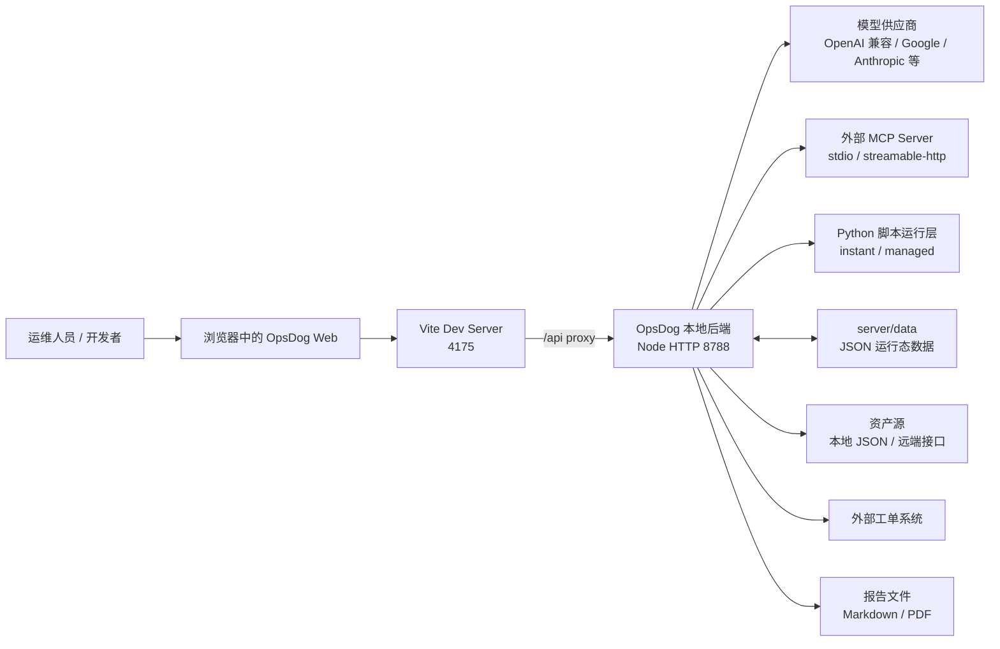
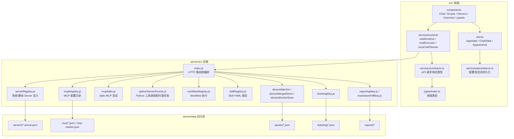
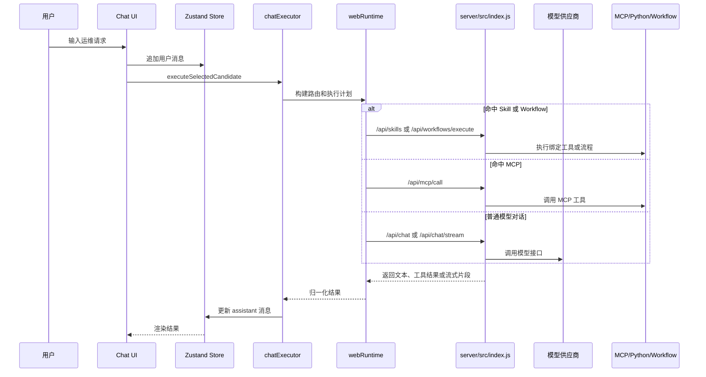
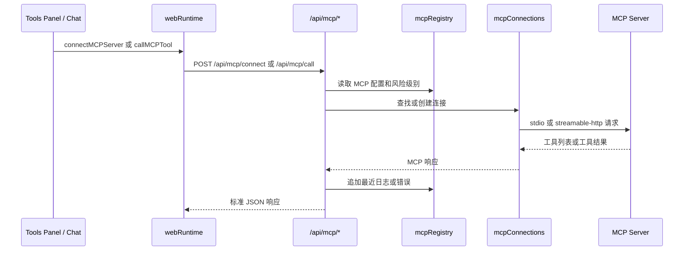
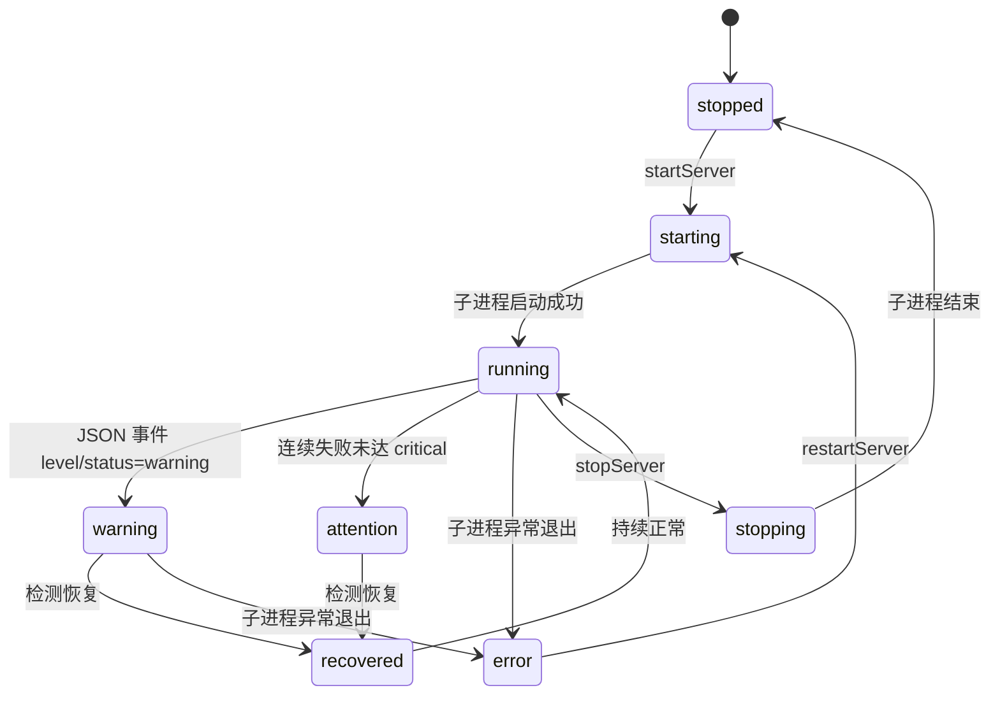
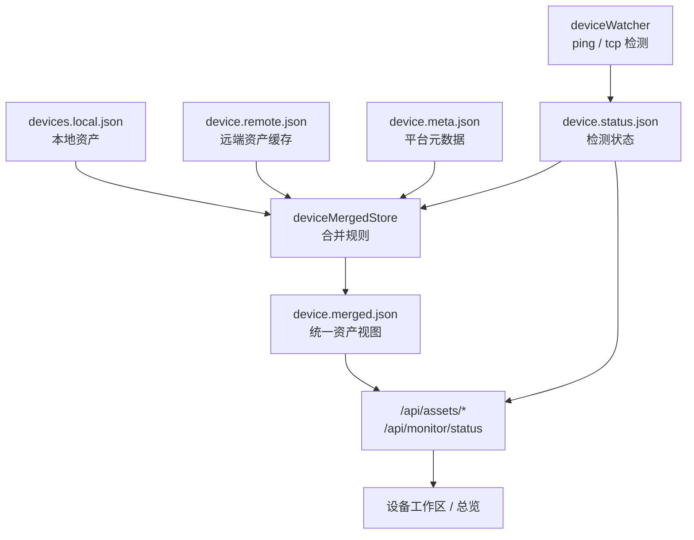

# OpsDog 项目结构与架构

最后核对日期：2026-05-19

本文面向后续开发者，目标是快速建立对当前系统的整体认识：代码放在哪里、模块边界是什么、运行链路怎么走、修改某类能力时应该先看哪些文件。

## 1. 项目定位

OpsDog Web 是一个本地优先的智能运维工作台。当前形态是 Vite + React 前端、本地 Node HTTP 后端、Python 脚本运行层、MCP 工具接入层和本地 JSON 运行态数据的组合。

核心能力：

- 对话式运维助手：通过模型、MCP、Skill 和 Workflow 完成任务。
- 即时任务：一次性执行脚本或工具。
- 托管任务：长期运行 Python 监控脚本，并把状态同步到界面。
- MCP 工具管理：连接、导入、安装、调用 MCP Server。
- 资产与设备状态：管理本地/远端资产，合并状态并展示在线、关注、异常。
- 报告与工单：生成巡检报告，预览或创建外部工单。

## 2. 顶层结构

```text
.
├── src/                         # React 前端
│   ├── components/              # 页面、面板、聊天、任务、设备、总览 UI
│   ├── services/                # 前端服务层、运行时适配、持久化、类型契约
│   ├── stores/                  # Zustand 全局状态和外观状态
│   ├── types/                   # 前端共享领域类型
│   ├── App.tsx                  # 应用装配、轮询、托管任务状态通知
│   ├── main.tsx                 # React 入口
│   └── index.css                # 当前全局样式入口
├── server/
│   ├── src/                     # 本地后端、注册表、MCP、Python Runner、资产/工单/报告
│   └── data/                    # 本地运行态 JSON、资产、MCP、报告、工单、Server 配置
├── tools/
│   ├── script/instant/          # 即时 Python 脚本及 server.json 元数据
│   ├── script/managed/          # 托管 Python 脚本及 server.json 元数据
│   └── skills/                  # Skill YAML 绑定定义
├── scripts/                     # 打包等仓库脚本
├── appConfig.js                 # 前后端地址、端口、API Base 配置解析
├── dev-all.js                   # 同时启动前端和后端
├── vite.config.ts               # Vite 插件、端口、代理配置
├── DEPLOY.md                    # 面向测试/交付的部署说明
├── 使用说明.md                  # 面向用户的功能使用说明
└── docs/                        # 面向开发者的文档体系
```

## 3. 运行入口

### 3.1 npm 脚本

| 命令 | 作用 |
| --- | --- |
| `npm run dev` / `npm run dev:web` | 启动 Vite 前端 |
| `npm run dev:server` | 启动本地 Node 后端 |
| `npm run dev:all` | 通过 `dev-all.js` 同时启动前后端 |
| `npm run build` / `npm run build:web` | TypeScript 检查并构建前端 |
| `npm run start:server` | 生产式启动本地后端 |
| `npm run package:test` | 生成测试分发包 |

### 3.2 地址和代理

默认开发地址：

- Web：`http://127.0.0.1:4175`
- API：`http://127.0.0.1:8788`

`appConfig.js` 从环境变量读取：

- `OPSDOG_WEB_ORIGIN`
- `OPSDOG_SERVER_ORIGIN`
- `VITE_API_BASE_URL`

`vite.config.ts` 使用这些值配置前端端口和 `/api` 代理。前端运行时通过 `VITE_API_BASE_URL` 访问后端，默认值为 `/api`。

## 4. 系统上下文图



## 5. 模块架构图



## 6. 前端模块边界

### 6.1 UI 层：`src/components`

当前 UI 按工作区和面板拆分：

| 目录/文件 | 职责 |
| --- | --- |
| `App.tsx` | 应用装配、后端健康轮询、托管任务状态轮询、系统公告、自动语音告警触发 |
| `components/Chat/` | 对话输入、消息列表、对话区 |
| `components/Scripts/` | 即时任务和托管任务界面 |
| `components/Servers/` | 设备/Server 工作区 |
| `components/Overview/` | 总览和运行态势 |
| `components/panels/` | 设置、Profile、工具、报告等侧面板 |
| `Sidebar.tsx` / `TopBar.tsx` | 应用导航和顶部状态 |
| `ToastViewport.tsx` | 全局提示 |

UI 层应尽量只处理展示、交互和轻量状态派发。涉及后端调用、MCP 规划、Skill 匹配、持久化同步时，应放到 `services/` 或 `stores/`。

### 6.2 状态层：`src/stores`

| 文件 | 职责 |
| --- | --- |
| `stores/index.ts` | 当前主 Zustand store，包含 UI 状态、配置、Server、Skill、对话状态和持久化触发 |
| `stores/appearance.ts` | 主题和背景预设读写 |

当前 `stores/index.ts` 同时承载 AppState、ChatState、持久化快照构建和初始化逻辑。后续如果继续扩展，应优先拆成配置、对话、Server/Skill、UI 外观等独立 slice。

### 6.3 运行时层：`src/services/runtime`

| 文件 | 职责 |
| --- | --- |
| `index.ts` | 暴露统一 runtime facade |
| `types.ts` | Runtime 接口定义 |
| `webRuntime.ts` | 浏览器环境下的 HTTP API 调用、本地缓存、MCP/Skill/Server/报告/资产方法 |
| `chatExecutor.ts` | 对话执行编排：Skill、MCP、Workflow、模型调用 |
| `mcpChatPlanner.ts` | MCP 工具定义、文件系统意图解析、工具结果格式化 |
| `webRouting.ts` | Web 端对话路由和执行计划 |
| `webSkills.ts` | 内置 Skill 元信息 |
| `filesystemDefaults.ts` | 文件系统相关默认值 |

开发原则：组件不应直接拼 `/api` 请求；应通过 runtime 方法访问后端，保证错误处理、类型契约和调用入口统一。

### 6.4 契约与类型

| 文件 | 职责 |
| --- | --- |
| `src/services/contracts.ts` | 前后端 API 请求/响应接口 |
| `src/types/index.ts` | UI、对话、Server、Skill、资产、运行结果等领域类型 |

当前契约是 TypeScript 类型，没有运行时校验。新增 API 时应同步更新 `contracts.ts`，并在后端补充输入校验。

## 7. 后端模块边界

### 7.1 HTTP 入口：`server/src/index.js`

`index.js` 当前负责：

- HTTP Server 创建、CORS、JSON/SSE/Binary 响应。
- `/api/*` 路由分发。
- 模型聊天、模型列表、流式聊天。
- MCP 连接、断开、调用、导入、市场安装。
- Skill、Workflow、Server 上传和执行。
- 资产、设备状态、报告、工单相关接口。
- 上游 TLS fallback、curl fallback、报告文件读写等辅助逻辑。

这是当前系统的主编排入口，也是后续重构优先级最高的文件之一。

### 7.2 Server 注册层：`server/src/serverRegistry.js`

负责将“系统 Server”和“脚本 Server”转成统一的 `ServerDefinition`：

- 系统 Server：filesystem、reporting、markdown_pdf、ticketing。
- 即时脚本：`tools/script/instant/*.server.json`。
- 托管脚本：`tools/script/managed/*.server.json`。
- Server 配置写入 `server/data/servers/*.server.json`。
- 启动时修复机器相关路径，例如 filesystem MCP 根目录、Node entry 路径。

注意：`server/data/servers/*.server.json` 与本机路径、Node 可执行文件、filesystem 根目录有关，属于机器相关运行态，测试包中应由目标机器重新生成。

### 7.3 MCP 层

| 文件 | 职责 |
| --- | --- |
| `mcpRegistry.js` | MCP 配置记录、导入 JSON/DXT、市场安装、风险级别、最近日志 |
| `mcpStdio.js` | stdio MCP Server 进程管理和协议交互 |
| `server/data/mcp/*.json` | 已保存的 MCP 记录 |
| `server/data/mcp-market.json` | 本地 MCP 市场清单 |

MCP Server 支持 `stdio` 和 `streamable-http`。前端可以手动/自动选择 MCP 工具，对话执行时根据风险级别过滤工具。

### 7.4 Python Server 层

| 文件 | 职责 |
| --- | --- |
| `pythonServerRunner.js` | 一次性调用、托管进程启动/停止/重启、日志和状态维护 |
| `tools/script/instant/` | 一次性脚本 |
| `tools/script/managed/` | 长期运行脚本 |

支持的协议模式：

- `json-tool`：脚本一次性输出 JSON 结果。
- `json-stream`：托管脚本持续输出 JSON 行事件。
- `cli-adapter`：将传统 CLI 参数和纯文本输出适配成统一工具结果。

### 7.5 Skill 与 Workflow

| 文件 | 职责 |
| --- | --- |
| `skillRegistry.js` | 读取/创建/更新/删除 `tools/skills/*/skill.yaml` |
| `workflowRegistry.js` | 基于 workflowId 执行工具链 |
| `tools/skills/*/skill.yaml` | Skill 元信息、触发词、Server 绑定、默认参数 |

当前概念关系：

- Server 是可执行能力的底座。
- Tool 是 Server 暴露的具体调用单元。
- Skill 是面向对话和业务语义的绑定层，把自然语言触发词映射到 Server/Tool。
- Workflow 是多步工具调用或任务链的编排入口。

### 7.6 资产、工单、报告

| 模块 | 关键文件 | 说明 |
| --- | --- | --- |
| 资产 | `deviceMergedStore.js`、`deviceMonitorStore.js`、`deviceWatcher.js` | 合并本地/远端资产，维护检测状态 |
| 工单 | `ticketingMcp.js` | 预览工单 payload、创建工单、维护资产映射和记录 |
| 报告 | `reportingMcp.js`、`markdownPdfMcp.js`、`markdownPdfRenderer.js` | 生成巡检报告、Markdown 转 PDF |

## 8. 数据目录说明

| 路径 | 类型 | 是否应随测试包保留 | 说明 |
| --- | --- | --- | --- |
| `server/data/assets/*.json` | 运行态/基线数据 | 是，保留当前基线 | 设备、远端资产、检测状态、合并结果 |
| `server/data/assets/templates/*.json` | 初始化模板 | 是 | 重置资产数据时使用 |
| `server/data/mcp/*.json` | MCP 配置 | 视场景保留 | 可保留非敏感 MCP 记录 |
| `server/data/servers/*.server.json` | 机器相关运行态 | 否，目标机器重新生成 | 包含本机路径、Node/npx 命令、filesystem 根 |
| `server/data/reports/*` | 生成物 | 否，除非明确交付样例 | 历史报告可能很大且与测试无关 |
| `server/data/ticketing/*.json` | 业务运行记录 | 资产映射可保留，历史记录谨慎 | `ticket-records.json` 可能包含业务数据 |

## 9. API 分组

当前 API 由 `server/src/index.js` 原生 HTTP 路由处理，主要分组如下：

| 分组 | 路由示例 | 作用 |
| --- | --- | --- |
| 健康检查 | `GET /api/health` | 后端在线状态 |
| 模型 | `POST /api/chat`、`POST /api/chat/stream`、`POST /api/models` | 模型调用和模型列表 |
| MCP | `/api/mcp/*` | MCP Server CRUD、连接、工具列表、调用、市场安装 |
| Server | `/api/servers/*` | 脚本上传、Server 列表、启动/停止/重启/调用 |
| Skill | `/api/skills/*` | Skill 列表、创建、更新、删除 |
| Workflow | `POST /api/workflows/execute` | Workflow 执行 |
| 资产 | `/api/assets/*`、`/api/monitor/status` | 资产列表、合并、重建、状态读取 |
| 报告 | `/api/reports/*` | 报告列表、读取、下载、预览、删除 |

后续新增 API 时，应同步更新 `src/services/contracts.ts`、`src/services/runtime/webRuntime.ts` 和 API 文档。

## 10. 关键流程

### 10.1 对话执行流



### 10.2 MCP 工具调用流



### 10.3 Skill 到 Server/Tool 的绑定流

```mermaid
flowchart LR
  UserText["用户自然语言"]
  Matcher["skillsMatcher / webRouting<br/>触发词匹配"]
  SkillYaml["tools/skills/*/skill.yaml"]
  SkillRecord["SkillRecord<br/>serverId + toolName"]
  ServerDef["ServerDefinition<br/>instant / managed / system"]
  Tool["ServerToolDefinition"]
  Runner["pythonServerRunner<br/>或 MCP call"]
  Result["ExecutionResult"]

  UserText --> Matcher
  Matcher --> SkillYaml
  SkillYaml --> SkillRecord
  SkillRecord --> ServerDef
  ServerDef --> Tool
  Tool --> Runner
  Runner --> Result
```



### 10.4 托管任务状态流



`App.tsx` 每 3 秒刷新 Server 状态，比较前后状态。当托管任务从正常进入告警，或从告警恢复时，会写入系统公告；如果配置了语音服务，并满足冷却条件，会调用 `aliyun_voice_make_call` Skill。

### 10.5 资产和设备状态流



## 11. 新增能力时的修改路径

### 11.1 新增一个即时脚本能力

1. 在 `tools/script/instant/` 放入 Python 脚本。
2. 新增同名 `.server.json`，定义 runtime、entry、tool、inputSchema、adapter。
3. 如需对话触发，在 `tools/skills/<name>/skill.yaml` 新增 Skill。
4. 确认 `serverRegistry.js` 能扫描到 Server。
5. 在 UI 中验证任务列表、Skill 列表和对话触发。
6. 更新相关文档：结构文档、使用说明或开发说明。

### 11.2 新增一个托管监控任务

1. 脚本放在 `tools/script/managed/`。
2. 输出协议优先使用 JSON 行事件，包含 status/level/message/time 等字段。
3. `.server.json` 设置 category 为 managed，声明 timeout、协议和默认参数。
4. 如果会影响告警/恢复判断，同步检查 `pythonServerRunner.js` 和 `App.tsx` 状态映射。
5. 更新状态流和排障文档。

### 11.3 新增一个 MCP Server

1. 通过 UI 或 `/api/mcp/servers` 创建 MCP 记录。
2. 明确 transport：`stdio` 或 `streamable-http`。
3. 设置 `riskLevel` 和 `toolRiskOverrides`，避免高风险工具被自动调用。
4. 验证连接、工具列表和调用结果。
5. 如需业务化触发，新增 Skill 或 Workflow 绑定。

### 11.4 新增一个后端 API

1. 在 `server/src/index.js` 添加路由，短期遵循当前原生 HTTP 风格。
2. 在 `src/services/contracts.ts` 添加请求/响应类型。
3. 在 `src/services/runtime/webRuntime.ts` 暴露 runtime 方法。
4. UI 层只调用 runtime 方法，不直接拼接 fetch。
5. 补充错误响应和输入校验。
6. 更新 API 文档。

## 12. 当前容易误用的边界

- `VITE_*` 会进入前端构建产物，不应放密钥。密钥应走后端 env 或用户本地配置。
- `server/data/servers/*.server.json` 是机器相关运行态，不应作为跨机器固定配置。
- `Skill` 不是脚本本身，它是自然语言触发和 Server/Tool 的绑定。
- `Server` 不是 MCP Server 的同义词。项目内 ServerDefinition 同时覆盖 Python 脚本能力、系统能力和 MCP 风格能力。
- `App.tsx` 当前包含副作用编排，新增轮询或自动触发前应谨慎，优先抽到 service/hook。
- `src/index.css` 是全局样式文件，新增样式前应确认不会破坏已有工作区。

## 13. 外部参考

- React 关于 Effect 和事件逻辑分离的建议：<https://react.dev/learn/separating-events-from-effects>
- Vite 环境变量和 `VITE_*` 暴露规则：<https://vite.dev/guide/env-and-mode.html>
- Zustand persist 机制：<https://zustand.site/en/docs/persist/>
- GitHub 仓库文档和安全最佳实践：<https://docs.github.com/en/enterprise-cloud%40latest/repositories/creating-and-managing-repositories/best-practices-for-repositories>
- ADR 轻量决策记录参考：<https://github.com/architecture-decision-record/architecture-decision-record>
