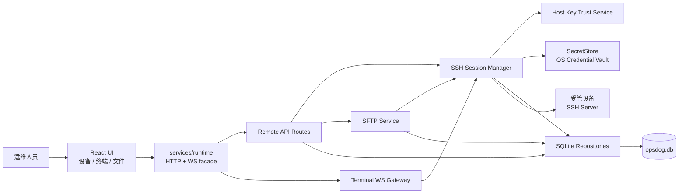
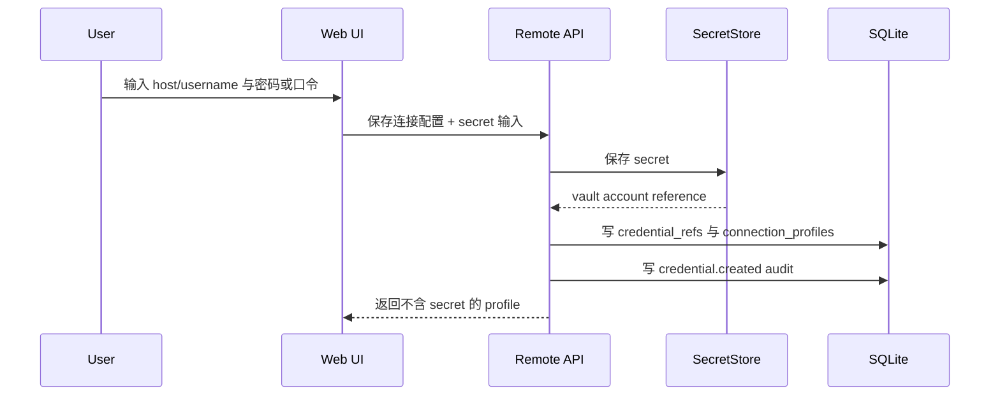
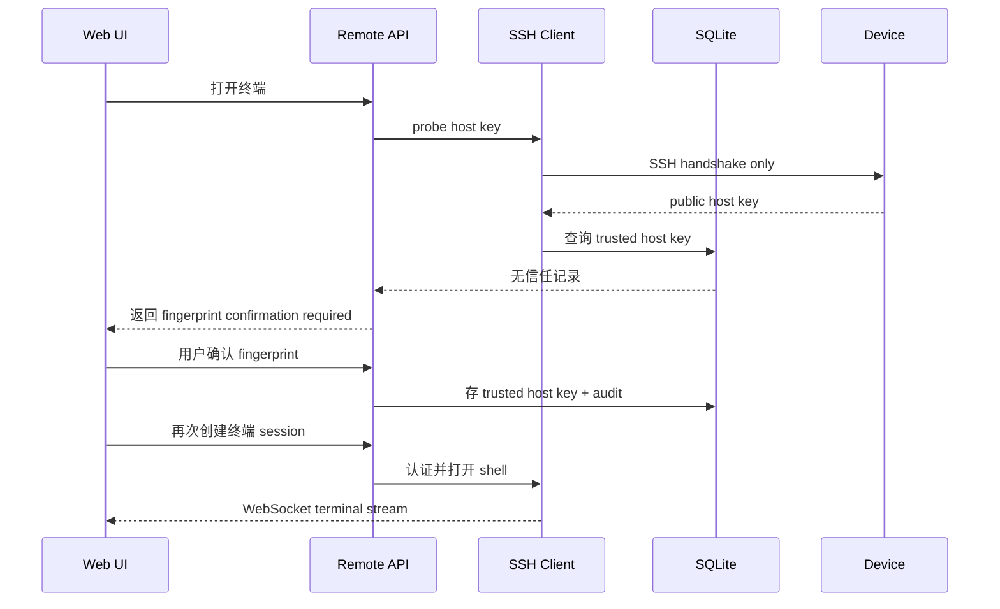

# OpsDog 本地远程终端与 SFTP 设计规范

- 状态：已确认方向；2026-05-26 批准以双门禁推进实施
- 日期：2026-05-26
- 适用产品形态：单机本地版 OpsDog Web
- 实施范围：人工 SSH 终端与 SFTP 文件管理；Telnet 后置；AI/自动化远程执行不在本期范围

## 1. 决策摘要

本项目在现有设备管理和监控能力上增加人工远程运维能力。第一条可交付链路是：

```text
设备资产 -> 连接配置 -> 系统凭据引用 -> SSH 主机指纹确认
        -> Web 交互终端 / SFTP 文件管理 -> 会话与文件操作审计
```

已经确认的产品决策：

| 事项 | 决策 |
| --- | --- |
| 远程方向 | OpsDog 主动连接已登记设备，不向外提供 SSH/Telnet Server |
| 部署模式 | 单机本地版，保持当前本地优先产品形态 |
| 主数据库 | SQLite，替代远程功能相关 JSON 作为主持久化层，并逐步承接资产/监控数据 |
| 数据库运行时 | 远程功能开发目标为 Node.js 24 LTS；阶段 1 以 `node:sqlite` 经适配层落地 |
| 凭据存储 | SQLite 只保存引用和元数据，密码与口令存入操作系统安全存储 |
| 第一期功能 | 人工 SSH 交互终端 + SFTP 文件浏览、上传、下载和文件操作审计 |
| Telnet | 以后作为明确启用的兼容适配器加入，默认禁用，不支持 SFTP |
| AI/自动化 | 不进入第一期执行面；以后单独完成审批、命令策略和脱敏设计后开发 |
| Windows 门禁 | 不阻断跨平台开发；Windows 运行时、Credential Manager 和分发验证通过前不发布 Windows 远程功能 |

## 2. 当前系统依据

当前仓库已经具备适合作为远程功能入口的基础：

| 已有能力 | 当前位置 | 本设计中的处理 |
| --- | --- | --- |
| React 设备管理工作区 | `src/components/Servers/ServersWorkspace.tsx` | 增加设备详情中的远程访问入口及后续终端/SFTP 页面 |
| 前端统一 runtime 调用方式 | `src/services/runtime/webRuntime.ts`、`src/services/runtime/types.ts` | 新 API 必须通过 runtime 暴露，不由组件拼接请求 |
| 领域类型和 API 契约 | `src/types/index.ts`、`src/services/contracts.ts` | 增加远程连接、会话、SFTP、审计类型 |
| 本地 Node HTTP 服务 | `server/src/index.js` | 仅挂接新路由与 WebSocket upgrade；远程逻辑下沉到独立模块 |
| 本地/远端资产合并 | `server/src/deviceMergedStore.js` | 首次数据迁移后由 SQLite repository 取代 JSON 主读写 |
| ping/tcp 状态检查 | `server/src/deviceWatcher.js`、`deviceMonitorStore.js` | 迁移到数据库监控表，不与 SSH 会话混杂 |
| JSON 运行态数据 | `server/data/assets/*.json` | 迁移时保留为备份/导入来源，不再作为新功能主数据库 |

约束与工程风险：

- `server/src/index.js` 已承载大量 API 编排，远程功能不能继续把协议和存储实现直接写入该文件。
- 当前未建立常规自动化测试体系；任何数据库迁移、连接与文件操作必须同时建立测试基础。
- 当前后端响应使用宽松 CORS；引入本机远程凭据和终端后，必须同步收紧访问边界。
- 现有 Windows 分发产物提示目标平台包含 Windows；SQLite 运行时、系统 keyring 绑定与依赖分发必须在宣称 Windows 远程功能可交付前经过 Windows 实机验证。

## 3. 目标与非目标

### 3.1 目标

1. 对本地或同步资产建立一个或多个 SSH 连接配置。
2. 使用系统安全存储管理密码和私钥口令，数据库与日志均不出现秘密值。
3. 首次 SSH 连接明确展示并确认 host key 指纹；指纹变化时中止连接。
4. 在浏览器界面打开交互终端，支持 PTY、窗口缩放、连接状态和主动断开。
5. 通过同一套 SSH 信任与认证策略提供 SFTP 文件管理。
6. 对连接生命周期、信任确认、SFTP 变更与传输操作写入可检索审计。
7. 以 SQLite 建立可迁移、可备份、可保留历史的数据基础，承接现有资产和监控数据。

### 3.2 本期非目标

以下内容明确不作为当前实施范围：

- OpsDog 对外提供 SSH 或 Telnet 登录服务。
- AI、模型、MCP 或托管脚本自动执行远程命令。
- 自动批量变更、命令审批流、命令白名单或敏感输出脱敏引擎。
- SSH 端口转发、agent forwarding、跳板机链路和 SCP。
- Telnet 协议适配及明文登录功能。
- 多用户共享、集中权限控制和 PostgreSQL 部署。

这些能力需要在本期交付稳定后单独设计，不因为字段预留而默认实现。

## 4. 技术选型

### 4.1 推荐技术栈

| 能力 | 推荐选择 | 选择理由 | 实施前验证 |
| --- | --- | --- | --- |
| 主数据库 | SQLite | 单机部署简单、事务可靠、备份清晰 | WAL、外键、迁移和 Windows 文件权限验证 |
| Node SQLite 绑定 | Node.js 24 LTS 下的 `node:sqlite`，封装在数据库适配层后使用 | 不引入原生 npm SQLite 依赖；schema 与 repository 不依赖绑定实现 | 当前允许开发；Windows 发布前验证，失败时替换适配实现 |
| SSH 与 SFTP | `ssh2` | 同一客户端库支持认证、host verification、shell/PTY 与 SFTP subsystem | OpenSSH 服务端兼容、异常关闭、大文件传输 |
| 终端 UI | `@xterm/xterm`、`@xterm/addon-fit` | 成熟浏览器终端组件，支持 resize | 中文/UTF-8、复制粘贴、全屏程序显示 |
| 终端实时通道 | `ws` | 可挂载到当前 Node HTTP server 的 upgrade 链路 | 短期 token、断线清理、背压 |
| 系统凭据适配 | 新建 `SecretStore` 接口；Windows 首选验证 `@napi-rs/keyring` | 避免将凭据写入 SQLite；避免依赖已归档 `keytar` | Windows Credential Manager 读写/删除及安装包加载 |

### 4.2 明确不采用的方案

| 方案 | 不采用原因 |
| --- | --- |
| 自行实现 SSH 协议或加密协商 | 算法协商、host key、认证和通道流控的兼容与安全风险不可接受 |
| 用 SFTP 包装库另外建立第二套连接体系 | 终端和文件访问应共享 host key、凭据、会话审计及连接错误模型 |
| 将密码或私钥正文加密后写入 SQLite | 已选定系统安全存储策略，减少应用自行管理主密钥的责任 |
| 第一阶段同时开发 Telnet | Telnet 无加密且无 SFTP，会分散 SSH/SFTP 交付验证精力 |

### 4.3 双门禁策略

2026-05-26 用户确认在暂时没有 Windows 测试环境的情况下继续开发，但 Windows 支持不得取消。门禁因此拆分如下：

**开发门禁（GO-DEV）：**

1. 开发主机可使用 SQLite 创建数据库、启用 WAL 和外键约束，并通过适配层避免业务代码耦合具体绑定。
2. 开发主机可通过系统安全存储创建、读取、覆盖和删除测试密码；SQLite、日志和结果记录不含秘密值。
3. 使用 `ssh2` 连接批准的测试 OpenSSH/SFTP 目标，完成 shell、resize、list、upload、download 和 cleanup。
4. 构建侧证明 `xterm.js` 与 `ws` 可进入后续终端实现。

**Windows 发布门禁（NO-GO-RELEASE-WINDOWS，直到实测通过）：**

1. Node.js 24 LTS 在 Windows 上启动服务并加载 `node:sqlite`、SSH、WebSocket 和 keyring 依赖。
2. SQLite 在 Windows 应用数据目录中完成建库、迁移、WAL、外键、重启读取、备份和包含空格/中文的路径测试。
3. Credential Manager 通过创建、读取、覆盖、删除及应用重启读取测试，并证明秘密值不进入 SQLite、日志或 API 响应。
4. Windows 测试包完成解压启动、依赖加载、健康检查以及 SSH/SFTP/host-key 行为验证。

开发门禁通过即可开始 SQLite 和跨平台远程模块实现；Windows 发布门禁未通过时，不得发布或宣称 Windows 远程功能完成。

## 5. 系统架构

### 5.1 组件图



### 5.2 模块边界

计划新增的后端模块：

```text
server/src/
  db/
    database.js                 # 打开数据库、PRAGMA、事务与关闭
    migrate.js                  # 有序执行 schema migration
    migrations/
      001_initial_core.sql      # schema、资产与监控基础
      002_remote_access.sql     # 凭据引用、host key、会话、SFTP、审计
    repositories/
      assetRepository.js
      monitorRepository.js
      remoteRepository.js
      auditRepository.js
  remote/
    secretStore.js              # 统一接口与系统 keyring 适配
    hostKeyService.js           # host key probe、确认与拒绝变化
    sshClientFactory.js         # 使用 profile + credential 创建 ssh2 Client
    sshSessionManager.js        # shell session 生命周期、PTY 和清理
    sftpService.js              # SFTP list/stat/mkdir/rename/remove/transfer
    terminalTokenStore.js       # 短期一次性 WebSocket token
    terminalWebSocket.js        # WS upgrade、输入输出、resize 与关闭
    remoteRoutes.js             # REST endpoint handler
```

计划新增或修改的前端模块：

```text
src/
  types/index.ts                        # 远程访问领域类型
  services/contracts.ts                 # REST 请求/响应契约
  services/runtime/types.ts             # facade 接口
  services/runtime/webRuntime.ts        # REST 与 terminal token 调用
  components/Servers/ServersWorkspace.tsx
  components/Remote/
    ConnectionProfilesPanel.tsx         # 连接配置及凭据引用操作
    HostKeyApprovalDialog.tsx           # 首次指纹确认/变化阻断
    TerminalWorkspace.tsx               # xterm.js 会话
    SftpWorkspace.tsx                   # 文件列表及传输
    AuditTimeline.tsx                   # 本设备远程操作记录
```

边界规则：

- `server/src/index.js` 只负责将 `/api/remote/*` 交给 `remoteRoutes`，以及将 WebSocket upgrade 交给 `terminalWebSocket`。
- SSH socket、SFTP handle、WebSocket 与密码永远不进入 React 状态或 SQLite。
- 所有持久化均通过 repository；协议模块不得自行拼 SQL。
- 所有用户可观察的 API 类型先定义在 `src/services/contracts.ts` 与 `src/types/index.ts`。

## 6. 数据库设计原则

### 6.1 文件与连接配置

| 项目 | 设计 |
| --- | --- |
| 数据库文件 | `server/data/opsdog.db` |
| 启动 PRAGMA | `foreign_keys = ON`、`journal_mode = WAL`、`busy_timeout = 5000` |
| 时间格式 | UTC ISO-8601 字符串，例如 `2026-05-26T08:00:00.000Z` |
| 主键 | 应用生成 UUID 文本；保留资产已有 source/external id 作为唯一业务键 |
| JSON 字段 | 仅存来源原始快照或非索引扩展元数据，核心筛选字段必须单列 |
| 迁移 | 只允许通过版本化 SQL migration 更新结构 |
| 删除策略 | 配置允许软删除；审计和已结束会话按保留策略清理，不因设备删除级联抹除 |
| 秘密值 | 严禁写入数据库、审计、终端日志或 API 响应 |

### 6.2 数据生命周期

| 数据类型 | 默认保留 | 说明 |
| --- | --- | --- |
| 资产与连接配置 | 直到用户删除 | 删除连接配置前先结束其活跃会话 |
| host key 信任记录 | 直到用户撤销 | 指纹变化保留历史并标记 `replaced`/`revoked` |
| 审计事件 | 180 天 | 用户可导出；清理动作本身需记审计 |
| 终端会话元数据 | 180 天 | 第一阶段默认保留元数据 |
| 终端输出转录 | 默认不保存内容 | 用户显式开启后按 30 天保留，输入按默认策略不记录 |
| SFTP 传输记录 | 180 天 | 不保存文件内容，只保存路径、大小、结果和摘要（若可取得） |
| 监控明细结果 | 30 天 | 当前状态单独保留，历史定期清理 |

### 6.3 本地单用户威胁边界

本期安全模型假设运行 OpsDog 的操作系统账户和本机环境可信：

- API、WebSocket 和数据库只服务于本机当前用户的工作流，不支持共享主机上的多租户隔离。
- loopback 监听与 Origin 校验可以阻断远程浏览器来源的误调用，但不能防御同一操作系统账户下的恶意进程。
- 如果未来要求防御同机恶意程序、多人登录同一机器或网络部署，需要另行引入桌面进程 IPC、用户认证和数据库/审计加密设计。

## 7. SQLite Schema

本节给出第一期应落地的表级结构。SQL 使用 SQLite 兼容语法；数据库绑定选型不会改变此 schema。

### 7.1 迁移与应用设置

```sql
CREATE TABLE schema_migrations (
  version INTEGER PRIMARY KEY,
  name TEXT NOT NULL,
  applied_at TEXT NOT NULL
);

CREATE TABLE app_settings (
  setting_key TEXT PRIMARY KEY,
  setting_value_json TEXT NOT NULL,
  updated_at TEXT NOT NULL
);

CREATE TABLE data_import_runs (
  id TEXT PRIMARY KEY,
  import_kind TEXT NOT NULL CHECK (import_kind IN ('json_assets_initial')),
  source_backup_path TEXT NOT NULL,
  status TEXT NOT NULL CHECK (status IN ('started', 'succeeded', 'failed')),
  imported_devices INTEGER NOT NULL DEFAULT 0,
  imported_monitor_profiles INTEGER NOT NULL DEFAULT 0,
  issue_count INTEGER NOT NULL DEFAULT 0,
  started_at TEXT NOT NULL,
  ended_at TEXT,
  error_message TEXT
);

CREATE TABLE data_import_issues (
  id TEXT PRIMARY KEY,
  import_run_id TEXT NOT NULL REFERENCES data_import_runs(id) ON DELETE CASCADE,
  source_file TEXT NOT NULL,
  source_record_key TEXT NOT NULL,
  issue_code TEXT NOT NULL,
  issue_summary TEXT NOT NULL,
  source_record_json TEXT,
  created_at TEXT NOT NULL
);
```

`app_settings` 仅保存非秘密策略，例如审计保留天数、是否显示 Telnet 功能开关。任何 credential secret 均禁止进入该表。`data_import_issues` 用于隔离当前 JSON 中已存在的孤立监控元数据等异常记录，以免一条无法关联设备的数据阻断整个首次迁移。

### 7.2 资产来源、设备与标签

```sql
CREATE TABLE asset_sources (
  id TEXT PRIMARY KEY,
  name TEXT NOT NULL,
  source_type TEXT NOT NULL CHECK (source_type IN ('local', 'remote_api')),
  read_only INTEGER NOT NULL DEFAULT 0 CHECK (read_only IN (0, 1)),
  config_json TEXT,
  created_at TEXT NOT NULL,
  updated_at TEXT NOT NULL
);

CREATE TABLE devices (
  id TEXT PRIMARY KEY,
  asset_source_id TEXT NOT NULL REFERENCES asset_sources(id),
  external_id TEXT NOT NULL,
  name TEXT NOT NULL,
  asset_id TEXT NOT NULL DEFAULT '',
  device_type TEXT NOT NULL CHECK (device_type IN ('server', 'storage', 'security', 'network')),
  asset_status TEXT NOT NULL DEFAULT 'healthy'
    CHECK (asset_status IN ('healthy', 'attention', 'critical', 'unknown')),
  ip_address TEXT NOT NULL DEFAULT '',
  management_ip TEXT NOT NULL DEFAULT '',
  manufacturer TEXT NOT NULL DEFAULT '',
  model TEXT NOT NULL DEFAULT '',
  serial_number TEXT NOT NULL DEFAULT '',
  organization TEXT NOT NULL DEFAULT '',
  owner TEXT NOT NULL DEFAULT '',
  location TEXT NOT NULL DEFAULT '',
  remark TEXT NOT NULL DEFAULT '',
  source_payload_json TEXT,
  deleted_at TEXT,
  created_at TEXT NOT NULL,
  updated_at TEXT NOT NULL,
  synced_at TEXT,
  UNIQUE (asset_source_id, external_id)
);

CREATE TABLE device_tags (
  device_id TEXT NOT NULL REFERENCES devices(id) ON DELETE CASCADE,
  tag TEXT NOT NULL,
  created_at TEXT NOT NULL,
  PRIMARY KEY (device_id, tag)
);

CREATE INDEX idx_devices_type_status ON devices(device_type, asset_status);
CREATE INDEX idx_devices_name ON devices(name);
CREATE INDEX idx_devices_ip ON devices(ip_address);
```

数据映射：

| 当前数据 | SQLite 映射 |
| --- | --- |
| `devices.local.json` 每条设备 | `asset_sources.id = 'local-default'` 下的一条 `devices` |
| `device.remote.json` 每条设备 | `asset_sources.id = 'remote-default'` 下的一条只读 `devices` |
| `device.merged.json` | 不迁移为主表；改为由查询关联设备、监控状态生成 API 响应 |
| `device.meta.json` 的 tags | `device_tags` |

### 7.3 监控配置和当前/历史状态

```sql
CREATE TABLE monitor_profiles (
  id TEXT PRIMARY KEY,
  device_id TEXT NOT NULL UNIQUE REFERENCES devices(id) ON DELETE CASCADE,
  enabled INTEGER NOT NULL DEFAULT 0 CHECK (enabled IN (0, 1)),
  check_ping INTEGER NOT NULL DEFAULT 0 CHECK (check_ping IN (0, 1)),
  check_tcp INTEGER NOT NULL DEFAULT 0 CHECK (check_tcp IN (0, 1)),
  target_host TEXT NOT NULL DEFAULT '',
  target_port INTEGER CHECK (target_port IS NULL OR target_port BETWEEN 1 AND 65535),
  interval_seconds INTEGER NOT NULL DEFAULT 5 CHECK (interval_seconds >= 1),
  timeout_ms INTEGER NOT NULL DEFAULT 3000 CHECK (timeout_ms >= 100),
  failure_threshold INTEGER NOT NULL DEFAULT 3 CHECK (failure_threshold >= 1),
  notify_voice INTEGER NOT NULL DEFAULT 0 CHECK (notify_voice IN (0, 1)),
  notify_alert INTEGER NOT NULL DEFAULT 1 CHECK (notify_alert IN (0, 1)),
  comment TEXT NOT NULL DEFAULT '',
  created_at TEXT NOT NULL,
  updated_at TEXT NOT NULL,
  CHECK (check_ping = 1 OR check_tcp = 1 OR enabled = 0)
);

CREATE TABLE monitor_current_status (
  monitor_profile_id TEXT PRIMARY KEY REFERENCES monitor_profiles(id) ON DELETE CASCADE,
  status TEXT NOT NULL DEFAULT 'unknown'
    CHECK (status IN ('healthy', 'attention', 'critical', 'unknown')),
  online INTEGER NOT NULL DEFAULT 0 CHECK (online IN (0, 1)),
  last_check_at TEXT,
  last_success_at TEXT,
  last_failure_at TEXT,
  latency_ms REAL,
  failure_count INTEGER NOT NULL DEFAULT 0,
  last_error TEXT NOT NULL DEFAULT '',
  message TEXT NOT NULL DEFAULT ''
);

CREATE TABLE monitor_results (
  id TEXT PRIMARY KEY,
  monitor_profile_id TEXT NOT NULL REFERENCES monitor_profiles(id) ON DELETE CASCADE,
  checked_at TEXT NOT NULL,
  status TEXT NOT NULL CHECK (status IN ('healthy', 'attention', 'critical', 'unknown')),
  online INTEGER NOT NULL CHECK (online IN (0, 1)),
  ping_ok INTEGER CHECK (ping_ok IS NULL OR ping_ok IN (0, 1)),
  tcp_ok INTEGER CHECK (tcp_ok IS NULL OR tcp_ok IN (0, 1)),
  latency_ms REAL,
  error_message TEXT NOT NULL DEFAULT '',
  result_message TEXT NOT NULL DEFAULT ''
);

CREATE INDEX idx_monitor_results_profile_time
  ON monitor_results(monitor_profile_id, checked_at DESC);
```

`deviceWatcher` 迁移后只更新监控 repository，不再读写 `device.status.json` 或重建合并 JSON 文件。

### 7.4 连接配置与系统凭据引用

```sql
CREATE TABLE credential_refs (
  id TEXT PRIMARY KEY,
  credential_type TEXT NOT NULL
    CHECK (credential_type IN ('password', 'private_key_passphrase')),
  vault_provider TEXT NOT NULL,
  vault_service TEXT NOT NULL,
  vault_account TEXT NOT NULL,
  label TEXT NOT NULL,
  secret_fingerprint TEXT,
  last_verified_at TEXT,
  deleted_at TEXT,
  created_at TEXT NOT NULL,
  updated_at TEXT NOT NULL,
  UNIQUE (vault_provider, vault_service, vault_account)
);

CREATE TABLE connection_profiles (
  id TEXT PRIMARY KEY,
  device_id TEXT NOT NULL REFERENCES devices(id),
  name TEXT NOT NULL,
  protocol TEXT NOT NULL CHECK (protocol IN ('ssh', 'telnet')),
  host TEXT NOT NULL,
  port INTEGER NOT NULL CHECK (port BETWEEN 1 AND 65535),
  username TEXT NOT NULL DEFAULT '',
  auth_method TEXT NOT NULL DEFAULT 'password'
    CHECK (auth_method IN ('password', 'private_key', 'agent', 'none')),
  password_credential_ref_id TEXT REFERENCES credential_refs(id),
  private_key_path TEXT,
  passphrase_credential_ref_id TEXT REFERENCES credential_refs(id),
  strict_host_key_checking INTEGER NOT NULL DEFAULT 1
    CHECK (strict_host_key_checking IN (0, 1)),
  sftp_enabled INTEGER NOT NULL DEFAULT 1 CHECK (sftp_enabled IN (0, 1)),
  encoding TEXT NOT NULL DEFAULT 'utf-8',
  connect_timeout_ms INTEGER NOT NULL DEFAULT 10000 CHECK (connect_timeout_ms >= 100),
  keepalive_interval_ms INTEGER NOT NULL DEFAULT 15000 CHECK (keepalive_interval_ms >= 0),
  is_default INTEGER NOT NULL DEFAULT 0 CHECK (is_default IN (0, 1)),
  enabled INTEGER NOT NULL DEFAULT 1 CHECK (enabled IN (0, 1)),
  deleted_at TEXT,
  created_at TEXT NOT NULL,
  updated_at TEXT NOT NULL,
  CHECK (
    (auth_method = 'password' AND password_credential_ref_id IS NOT NULL)
    OR auth_method <> 'password'
  ),
  CHECK (
    protocol = 'ssh'
    OR (sftp_enabled = 0 AND strict_host_key_checking = 0)
  )
);

CREATE UNIQUE INDEX idx_connection_profiles_default_device
  ON connection_profiles(device_id)
  WHERE is_default = 1 AND deleted_at IS NULL;

CREATE INDEX idx_connection_profiles_device
  ON connection_profiles(device_id, protocol, enabled);
```

安全说明：

- `credential_refs` 存储的 `vault_account` 是定位系统凭据项的标识，不是秘密内容。
- `secret_fingerprint` 仅允许存不可逆摘要，用于判断引用是否被更新；不得可用于恢复秘密。
- 私钥第一期通过 `private_key_path` 或后续 SSH Agent 访问；私钥正文不写入数据库。
- `telnet` 只为后置 schema 兼容而保留枚举，第一期 UI 与 route 不允许创建该协议配置。

### 7.5 SSH 主机信任

```sql
CREATE TABLE ssh_host_keys (
  id TEXT PRIMARY KEY,
  host TEXT NOT NULL,
  port INTEGER NOT NULL CHECK (port BETWEEN 1 AND 65535),
  key_type TEXT NOT NULL,
  fingerprint_sha256 TEXT NOT NULL,
  public_key_base64 TEXT NOT NULL,
  trust_status TEXT NOT NULL
    CHECK (trust_status IN ('trusted', 'revoked', 'replaced')),
  first_seen_at TEXT NOT NULL,
  trusted_at TEXT,
  last_seen_at TEXT NOT NULL,
  revoked_at TEXT,
  replaced_by_id TEXT REFERENCES ssh_host_keys(id),
  UNIQUE (host, port, key_type, fingerprint_sha256)
);

CREATE UNIQUE INDEX idx_ssh_host_keys_active_trust
  ON ssh_host_keys(host, port, key_type)
  WHERE trust_status = 'trusted';
```

信任规则：

1. 首次连接探测 host key 后，不创建 shell/SFTP session；前端必须显示算法、SHA256 指纹和目标地址供用户确认。
2. 用户确认后，将 key 标为 `trusted` 并重新建立连接。
3. 后续 host key 不一致时，连接立即失败；旧 key 不被自动覆盖。
4. 用户显式接受更换时，将旧记录标为 `replaced` 并关联新记录，同时写入审计。

### 7.6 远程会话与终端记录

```sql
CREATE TABLE remote_sessions (
  id TEXT PRIMARY KEY,
  connection_profile_id TEXT NOT NULL REFERENCES connection_profiles(id),
  device_id TEXT NOT NULL REFERENCES devices(id),
  session_kind TEXT NOT NULL CHECK (session_kind IN ('terminal', 'sftp')),
  protocol TEXT NOT NULL CHECK (protocol IN ('ssh', 'telnet')),
  actor_type TEXT NOT NULL DEFAULT 'human'
    CHECK (actor_type IN ('human', 'automation', 'ai')),
  state TEXT NOT NULL
    CHECK (state IN ('opening', 'active', 'closing', 'closed', 'failed')),
  host_key_id TEXT REFERENCES ssh_host_keys(id),
  transcript_policy TEXT NOT NULL DEFAULT 'metadata_only'
    CHECK (transcript_policy IN ('metadata_only', 'output_only')),
  remote_address TEXT NOT NULL,
  negotiated_algorithms_json TEXT,
  started_at TEXT NOT NULL,
  authenticated_at TEXT,
  ended_at TEXT,
  ended_reason TEXT,
  error_code TEXT,
  error_message TEXT
);

CREATE TABLE terminal_transcript_chunks (
  id TEXT PRIMARY KEY,
  session_id TEXT NOT NULL REFERENCES remote_sessions(id) ON DELETE CASCADE,
  sequence_number INTEGER NOT NULL,
  direction TEXT NOT NULL DEFAULT 'output' CHECK (direction = 'output'),
  content_text TEXT NOT NULL,
  recorded_at TEXT NOT NULL,
  redaction_state TEXT NOT NULL DEFAULT 'unreviewed'
    CHECK (redaction_state IN ('unreviewed', 'redacted', 'not_required')),
  UNIQUE (session_id, sequence_number)
);

CREATE INDEX idx_remote_sessions_device_time
  ON remote_sessions(device_id, started_at DESC);

CREATE INDEX idx_transcript_chunks_session_seq
  ON terminal_transcript_chunks(session_id, sequence_number);
```

终端审计边界：

- 第一阶段默认 `transcript_policy = 'metadata_only'`，即记录谁在何时连接、断开和结果，不保存终端内容。
- 用户明确开启记录时，仅记录远端输出；键盘输入可能包含 `sudo` 密码或应用内秘密，第一阶段禁止写入转录表。
- 交互式 shell 中的键盘流不能可靠等价为“执行过的命令”，页面不得将转录冒充精确命令审计。
- `actor_type` 为未来隔离自动化/AI 会话提供边界；第一期只能创建 `human`。

### 7.7 SFTP 操作和传输审计

```sql
CREATE TABLE sftp_operations (
  id TEXT PRIMARY KEY,
  session_id TEXT NOT NULL REFERENCES remote_sessions(id),
  device_id TEXT NOT NULL REFERENCES devices(id),
  operation_type TEXT NOT NULL
    CHECK (operation_type IN ('list', 'stat', 'mkdir', 'rename', 'delete')),
  remote_path TEXT NOT NULL,
  destination_path TEXT,
  confirmation_required INTEGER NOT NULL DEFAULT 0
    CHECK (confirmation_required IN (0, 1)),
  confirmation_received INTEGER NOT NULL DEFAULT 0
    CHECK (confirmation_received IN (0, 1)),
  status TEXT NOT NULL CHECK (status IN ('started', 'succeeded', 'failed', 'cancelled')),
  error_message TEXT,
  started_at TEXT NOT NULL,
  ended_at TEXT
);

CREATE TABLE sftp_transfers (
  id TEXT PRIMARY KEY,
  session_id TEXT NOT NULL REFERENCES remote_sessions(id),
  device_id TEXT NOT NULL REFERENCES devices(id),
  direction TEXT NOT NULL CHECK (direction IN ('upload', 'download')),
  remote_path TEXT NOT NULL,
  display_file_name TEXT NOT NULL,
  size_bytes INTEGER,
  transferred_bytes INTEGER NOT NULL DEFAULT 0,
  checksum_sha256 TEXT,
  overwrite_confirmed INTEGER NOT NULL DEFAULT 0 CHECK (overwrite_confirmed IN (0, 1)),
  status TEXT NOT NULL
    CHECK (status IN ('started', 'succeeded', 'failed', 'cancelled')),
  error_message TEXT,
  started_at TEXT NOT NULL,
  ended_at TEXT
);

CREATE INDEX idx_sftp_operations_device_time
  ON sftp_operations(device_id, started_at DESC);

CREATE INDEX idx_sftp_transfers_device_time
  ON sftp_transfers(device_id, started_at DESC);
```

文件管理规则：

- 下载内容由 API 流式返回浏览器，不默认落在后端服务器的可持久目录。
- 上传由浏览器上传流转发到 SFTP；覆盖已有文件必须先获取确认 token。
- `delete`、`rename`、`mkdir` 和覆盖上传均写入审计，其中删除和覆盖必须显式确认。
- 文件内容本身不写入 SQLite；可在成功传输后存 SHA-256 摘要用于操作追踪。

### 7.8 通用审计事件

```sql
CREATE TABLE audit_events (
  id TEXT PRIMARY KEY,
  event_type TEXT NOT NULL,
  actor_type TEXT NOT NULL DEFAULT 'human'
    CHECK (actor_type IN ('human', 'system', 'automation', 'ai')),
  actor_label TEXT NOT NULL DEFAULT 'local-user',
  device_id TEXT REFERENCES devices(id),
  connection_profile_id TEXT REFERENCES connection_profiles(id),
  session_id TEXT REFERENCES remote_sessions(id),
  risk_level TEXT NOT NULL DEFAULT 'read-only'
    CHECK (risk_level IN ('read-only', 'state-change', 'destructive')),
  outcome TEXT NOT NULL CHECK (outcome IN ('attempted', 'succeeded', 'failed', 'denied')),
  summary TEXT NOT NULL,
  detail_json TEXT,
  created_at TEXT NOT NULL
);

CREATE INDEX idx_audit_events_time ON audit_events(created_at DESC);
CREATE INDEX idx_audit_events_device_time ON audit_events(device_id, created_at DESC);
CREATE INDEX idx_audit_events_session_time ON audit_events(session_id, created_at ASC);
```

必须记录的事件：

| 事件 | 风险级别 | 关键详情 |
| --- | --- | --- |
| `credential.created`、`credential.updated`、`credential.deleted` | `state-change` | 只写引用 ID 与 label，不写秘密 |
| `host_key.approved`、`host_key.replaced`、`host_key.rejected` | `state-change` | host、port、old/new fingerprint |
| `terminal.session.opened`、`terminal.session.closed`、`terminal.session.failed` | `read-only` | profile、device、结束原因 |
| `sftp.download` | `read-only` | path、size、状态 |
| `sftp.upload`、`sftp.mkdir`、`sftp.rename` | `state-change` | path、confirmation、状态 |
| `sftp.delete`、`sftp.overwrite` | `destructive` | path、confirmation、状态 |
| `audit.retention.cleaned` | `state-change` | 清理截止时间与数量 |

`detail_json` 建立严格允许字段列表，不能简单存放异常对象、请求 body 或 SSH library debug output。

## 8. 凭据与 SSH 信任流程

### 8.1 创建连接配置



API 接收密码仅限 HTTPS/本机 loopback 的当前请求内存；不得打日志，不得回显，不得进入 Redux/Zustand 持久化快照。

### 8.2 首次 SSH 连接



### 8.3 指纹变化

当已信任地址返回新的指纹时：

1. API 返回 `HOST_KEY_MISMATCH`，不得创建终端或 SFTP session。
2. UI 明确展示旧指纹、新指纹和风险提示。
3. 仅用户主动执行“接受更换”后，才产生新 trusted key。
4. 更换操作必须写入 `host_key.replaced` 审计。

## 9. API 与 WebSocket 契约边界

API path 可在实施时按既有 router 形式落地，但语义必须保持如下边界。

### 9.1 连接与凭据

| 方法 | Path | 用途 | 敏感规则 |
| --- | --- | --- | --- |
| `GET` | `/api/remote/devices/:deviceId/profiles` | 列出设备连接配置 | 不返回 secret、vault 内部值 |
| `POST` | `/api/remote/devices/:deviceId/profiles` | 新建配置并可写入 credential | secret 仅请求期存在 |
| `PATCH` | `/api/remote/profiles/:profileId` | 更新连接参数 | 修改 secret 使用单独字段并覆盖 vault |
| `DELETE` | `/api/remote/profiles/:profileId` | 软删除配置及可选删除 credential | 有活跃 session 时拒绝 |
| `POST` | `/api/remote/profiles/:profileId/test` | 测试握手/认证/SFTP 能力 | 首次 host key 未确认时返回 challenge |

### 9.2 Host key 信任

| 方法 | Path | 用途 |
| --- | --- | --- |
| `POST` | `/api/remote/profiles/:profileId/host-key/probe` | 获取本次连接提供的指纹 |
| `POST` | `/api/remote/profiles/:profileId/host-key/trust` | 用户确认首次指纹 |
| `POST` | `/api/remote/profiles/:profileId/host-key/replace` | 用户确认替换变更指纹 |
| `GET` | `/api/remote/profiles/:profileId/host-keys` | 查看信任历史 |

### 9.3 终端

| 方法 | Path | 用途 |
| --- | --- | --- |
| `POST` | `/api/remote/profiles/:profileId/terminal-sessions` | 创建 session 并返回一次性 WS token |
| `DELETE` | `/api/remote/terminal-sessions/:sessionId` | 关闭 session |
| `GET` | `/api/remote/devices/:deviceId/sessions` | 查询连接历史 |
| `GET` | `/api/remote/sessions/:sessionId/transcript` | 仅对开启转录的已结束会话返回可见转录 |

WebSocket 通道：

```text
GET /api/remote/terminal/socket?token=<one-time-short-lived-token>
```

消息模型：

```json
{ "type": "input", "data": "ls\r" }
{ "type": "resize", "cols": 120, "rows": 36 }
{ "type": "output", "data": "..." }
{ "type": "state", "state": "active" }
{ "type": "closed", "reason": "user-disconnect" }
{ "type": "error", "code": "SSH_AUTH_FAILED", "message": "认证失败" }
```

安全要求：

- token 一次性、短有效期且绑定 session；使用后立即失效。
- WebSocket origin 按本机前端 origin 校验。
- disconnect、浏览器关闭和 SSH error 均最终关闭 session 并写审计。
- terminal input 不写普通服务日志。

### 9.4 SFTP

| 方法 | Path | 用途 | 是否需要确认 |
| --- | --- | --- | --- |
| `POST` | `/api/remote/profiles/:profileId/sftp-sessions` | 建立 SFTP session | 否 |
| `GET` | `/api/remote/sftp-sessions/:id/list?path=` | 文件列表 | 否 |
| `GET` | `/api/remote/sftp-sessions/:id/download?path=` | 下载文件 | 否 |
| `POST` | `/api/remote/sftp-sessions/:id/uploads` | 上传新文件 | 文件已存在时需要 |
| `POST` | `/api/remote/sftp-sessions/:id/mkdir` | 创建目录 | 是 |
| `POST` | `/api/remote/sftp-sessions/:id/rename` | 重命名/移动 | 是 |
| `DELETE` | `/api/remote/sftp-sessions/:id/entries` | 删除远端条目 | 是 |

确认机制沿用统一风险理念：服务端返回操作摘要与短期 confirmation token，用户确认后才执行具有状态变更或破坏性的操作。

## 10. 前端用户流程

### 10.1 设备页面

在现有设备管理流程上增加“远程访问”信息，而不把终端逻辑混入资产编辑表单：

1. 用户选择一台设备，进入详情。
2. 详情新增“概览 / 远程访问 / 连接历史”分区。
3. “远程访问”显示连接配置列表、默认配置、连接测试、打开终端、打开文件管理。
4. 不可编辑的远端同步资产仍允许创建本地连接配置，因为连接配置属于本地运维元数据，不改写远端资产。

### 10.2 连接配置

配置表单包括：

- 协议：第一期仅展示 SSH。
- Host、port、username。
- 认证方式：password、private key file、agent（agent 可在阶段 0 后决定是否显示）。
- password 或 passphrase 输入只在保存时提交，不展示已存值。
- SFTP 可用开关、连接超时和 keepalive。
- 默认配置选择。

### 10.3 终端工作区

终端 UI 必须提供：

- 当前设备、目标地址、用户名、SSH 状态。
- 首次 host key 确认弹窗。
- `xterm.js` 终端区域，resize 自动同步。
- 用户主动断开操作。
- 错误状态：网络不可达、认证失败、指纹变化、PTY 创建失败、连接中断。
- 当前记录策略标识，例如“仅记录连接元数据”。

### 10.4 SFTP 工作区

SFTP UI 必须提供：

- 面包屑路径、目录列表、刷新和上一级。
- 上传、下载、创建目录、重命名、删除。
- 上传/下载进度、取消、失败原因。
- 覆盖与删除确认对话框。
- 最近文件操作审计入口。

## 11. 错误模型与日志

### 11.1 可向用户显示的错误码

| Code | 展示含义 | 处理动作 |
| --- | --- | --- |
| `REMOTE_PROFILE_NOT_FOUND` | 连接配置不存在或已删除 | 返回配置列表 |
| `SECRET_UNAVAILABLE` | 系统凭据不存在或无法读取 | 提示重新保存凭据 |
| `SSH_HOST_KEY_CONFIRMATION_REQUIRED` | 首次连接需确认指纹 | 打开确认对话框 |
| `SSH_HOST_KEY_MISMATCH` | 主机指纹与信任记录不符 | 阻断并展示更换流程 |
| `SSH_AUTH_FAILED` | SSH 认证失败 | 检查用户名/凭据 |
| `SSH_CONNECTION_TIMEOUT` | 连接超时 | 检查目标和网络 |
| `SSH_CHANNEL_FAILED` | 终端通道建立失败 | 关闭 session 并记录失败 |
| `SFTP_UNAVAILABLE` | 服务端未开放 SFTP | 禁用文件操作 |
| `SFTP_PERMISSION_DENIED` | 远端权限不足 | 保留当前路径并提示 |
| `CONFIRMATION_REQUIRED` | 变更操作待用户确认 | 展示确认摘要 |

### 11.2 日志规则

允许记录：

- session id、profile id、device id。
- 连接阶段与错误码。
- host key 的公开指纹。
- SFTP 路径、操作类别、结果和字节数。

禁止记录：

- 密码、私钥正文、passphrase、系统 vault 返回内容。
- 用户输入的终端字节流。
- 上传或下载文件正文。
- 未过滤的请求体、异常栈中附带的秘密参数。

## 12. 现有 JSON 数据迁移

### 12.1 迁移原则

1. 首次启用 SQLite 时，在修改任何现有 JSON 前对 `server/data/assets/` 创建时间戳备份。
2. 迁移过程在单个数据库事务中进行，失败则不切换数据来源。
3. 导入完成后写入 migration version、`data_import_runs` 和导入摘要审计。
4. 旧 JSON 文件保留用于回滚读取，不在成功切换后继续作为主写入目标。
5. 当前 `/api/assets/devices` 和 `/api/assets/merged` 的前端响应形状保持兼容，降低 UI 切换风险。
6. 对存在元数据但不存在对应资产的记录写入 `data_import_issues` 并跳过关联导入；不得因当前仓库已存在的孤立 `device.meta.json` 记录导致整次迁移失败。

### 12.2 字段映射

| JSON 文件 | 导入表 | 映射要点 |
| --- | --- | --- |
| `devices.local.json` | `asset_sources`, `devices` | source 固定为 `local-default`，保留本地可编辑属性 |
| `device.remote.json` | `asset_sources`, `devices` | source 固定为 `remote-default`，`read_only = 1`，保留来源 JSON 快照 |
| `device.meta.json` | `device_tags`, `monitor_profiles` | `checkType = ping+tcp` 拆为两个布尔列 |
| `device.status.json` | `monitor_current_status` | 仅导入最新状态，不制造虚构历史 |
| `device.merged.json` | 无 | 这是派生结果，迁移后由 repository 查询产生 |

当前仓库校验到 `device.remote.json` 可以为空而 `device.meta.json` 仍保留远端监控条目。因此，导入顺序必须先建立实际 `devices` 集合，再关联导入 meta/status；无对应设备的数据进入 `data_import_issues`，供用户查看或等远端资产再次同步后人工补录。

### 12.3 回滚策略

- schema 初始化或导入失败：保持旧 JSON API 行为并提示数据库启用失败，不删除备份。
- 已成功切换但发现严重问题：停止写入数据库后，用迁移前备份恢复到旧版本程序；数据库文件保留用于问题分析。
- 每次数据库 migration 前生成 `.db` 备份副本；备份保留数量和清理策略由 `app_settings` 管理。

## 13. 安全要求

### 13.1 必须满足

| 类别 | 要求 |
| --- | --- |
| 网络暴露 | API 和 terminal WebSocket 默认仅绑定 loopback；非本机部署不属于本期支持范围 |
| CORS/Origin | 远程访问 route 与 WS 只允许已配置本机 Web origin，不延续任意来源访问 |
| 凭据 | 仅存系统 vault 引用；创建、更新、删除均审计；错误不可泄露 secret |
| SSH 信任 | strict host key checking 默认开启且不可被普通连接流程静默关闭 |
| SFTP 写操作 | 上传覆盖、删除、rename、mkdir 需显式确认；动作和结果审计 |
| 会话清理 | 页面关闭、断网、后端退出均释放 SSH/SFTP/WS 资源并最终化会话状态 |
| 记录策略 | 默认只存会话元数据，不默认存交互输入和敏感输出 |
| AI 隔离 | 本期没有可供 Chat/MCP/Task 调用远程 SSH/SFTP 的工具入口 |

### 13.2 后续 Telnet 约束

若以后实施 Telnet：

- 创建连接时必须展示“明文协议”警告并要求确认。
- 默认 feature flag 关闭，且禁止存储 Telnet 密码用于无人值守行为。
- Telnet session 必须在 UI 和审计中明确标识不安全协议。
- Telnet 不提供 SFTP，不复用 SSH host key 概念。

## 14. 测试与验收矩阵

### 14.1 数据库和迁移

| 场景 | 验收 |
| --- | --- |
| 空数据库启动 | migrations 按顺序成功，所有 PRAGMA 生效 |
| 从现有 JSON 导入 | 资产数量、标签、当前监控状态与导入前 API 响应一致 |
| 重复启动 | 导入不重复创建资产或 profile |
| migration 中途失败 | 事务回滚，旧数据可继续使用 |
| 备份与恢复 | 可从启动前备份恢复原数据库或原 JSON 数据 |

### 14.2 凭据和信任

| 场景 | 验收 |
| --- | --- |
| 保存密码 | 系统 vault 可读取，SQLite/log/API response 查不到 secret |
| 删除凭据 | vault 项与引用按用户意图删除，操作被审计 |
| 首次 SSH 指纹 | 连接被暂停，用户确认后才能打开终端/SFTP |
| 指纹变化 | 连接被阻断，不能通过普通重试绕过 |

### 14.3 SSH 终端

| 场景 | 验收 |
| --- | --- |
| 密码/私钥认证 | 目标 OpenSSH 服务可建立 session |
| PTY resize | 改变浏览器终端大小后远端 `stty size` 反映变化 |
| 大输出 | 输出持续滚动，无死锁或显著丢失 |
| 中断与重连 | SSH 断开后状态清晰，资源释放，允许新建会话 |
| 浏览器关闭 | 后端最终关闭对应 session 并写入审计 |

### 14.4 SFTP

| 场景 | 验收 |
| --- | --- |
| list/download | 只读操作可完成并记结果 |
| upload 新文件 | 显示进度并记录成功/失败 |
| 覆盖上传 | 未确认不得覆盖，确认后只执行一次 |
| rename/delete/mkdir | 有确认与审计，权限失败清晰反馈 |
| 大文件/取消 | 流式传输，不耗尽服务端内存；取消后状态一致 |

### 14.5 安全回归

| 场景 | 验收 |
| --- | --- |
| 日志扫描 | 不出现密码、口令、私钥正文或请求中的 secret |
| 未授权 WS token | 过期、重复使用、错误 origin 均拒绝 |
| AI/聊天路径 | 不存在调用远程 SSH/SFTP 的已注册 tool |
| 打包安装 | Windows 包内 SQLite、keyring、SSH/SFTP、终端均工作 |

## 15. 交付阶段与退出门槛

### 阶段 0：依赖与安全存储 POC

目标：在不影响现有资产业务的前提下，验证关键技术依赖足以开始跨平台开发，并列明 Windows 发布前必须完成的实测项。

工作内容：

- 建立最小测试框架与临时 POC 页面/API。
- 比较 `node:sqlite` 与 `better-sqlite3` 对当前 Node 运行时的可行性，以 Node.js 24 LTS + `node:sqlite` 适配层作为开发选择。
- 建立 `SecretStore` 接口并验证系统 credential vault 绑定。
- 验证 `ssh2` shell、PTY resize 与 SFTP。
- 验证 `xterm.js` + `ws` 的终端流。

退出门槛：

- 开发主机与批准的 SSH/SFTP 测试目标完成 GO-DEV 证据记录。
- SQLite 中不存在任何测试秘密明文。
- 形成固定依赖版本、Node.js 24 LTS 目标和 Windows 发布阻断测试矩阵。

### 阶段 1：SQLite 底座与资产/监控迁移

目标：使 SQLite 成为资产、监控和远程配置的可靠数据基础，同时保持现有设备页面可用。

工作内容：

- 创建 migration runner 与第 1、2 版 schema。
- 创建 asset/monitor/remote/audit repositories。
- 实现 JSON 备份与一次性导入。
- 将现有资产和监控 API 内部实现切换为 repository。
- 将 `deviceWatcher` 状态写入 SQLite。

退出门槛：

- 现有设备页面、总览与状态检测功能无回归。
- 导入、重启幂等、失败回滚与备份恢复验证通过。

### 阶段 2：SSH 人工终端

目标：从设备详情以可信、可审计的方式打开稳定 SSH 终端。

工作内容：

- 连接配置与 SecretStore UI/API。
- SSH host key probe、确认、变化阻断流程。
- SSH session manager、一次性 token 和 terminal WebSocket。
- `xterm.js` 终端界面、resize、断开及错误显示。
- 会话元数据和 host key 审计。

退出门槛：

- 用户可在测试设备上完成首次信任、登录、交互与重连。
- 认证失败、指纹变化、断线和关闭页面均安全结束并可追踪。

### 阶段 3：SFTP 文件管理

目标：在既有 SSH 信任与凭据基础上提供人工文件操作。

工作内容：

- SFTP session 和目录浏览接口。
- 上传、下载流及进度/取消处理。
- mkdir、rename、delete、覆盖上传确认机制。
- 文件操作和传输审计 UI。

退出门槛：

- 小文件与大文件传输稳定；失败、取消、权限不足可解释。
- 所有变更/破坏性操作均有显式确认和审计。

### 阶段 4：加固与发布

目标：完成本地远程访问能力的发布准备。

工作内容：

- 限制 CORS/origin、loopback 监听及 WS token 策略。
- 审计保留清理、数据库备份与导出。
- Windows 包完整回归、Credential Manager/SQLite/路径/启动脚本/SSH-SFTP 实机验收和用户文档。
- 确认远程能力未暴露给 Chat、MCP 或自动任务。

退出门槛：

- Windows 发布门禁测试矩阵完成并保留验收记录。
- 打包版本支持安装后首次初始化、升级迁移和恢复。

### 阶段 5：独立后续设计，不属于本期实现

只有阶段 4 稳定发布后，才能针对 AI/自动化远程执行启动新的设计文档。新设计至少要覆盖：

- 命令级准确执行链路（使用 SSH `exec`，不依赖人工 shell 键盘转录）。
- 工具暴露范围、风险分类、人工审批、只读/变更/破坏性策略。
- 输出脱敏、凭据不可见、命令和结果的不可抵赖审计。
- 目标设备与操作权限模型。

## 16. 后续实施计划应拆分的任务包

用户复核本文档后，应另行编写可逐项勾选执行的实现计划，至少拆为以下独立任务包：

| 任务包 | 可独立验收成果 |
| --- | --- |
| P0. 测试与依赖验证 | SQLite/SecretStore/SSH/SFTP/终端的 POC 与依赖决定 |
| P1. 数据库基础 | migration、repository、备份恢复与数据库测试 |
| P2. JSON 导入与旧 API 兼容 | 现有资产/监控从 SQLite 返回且前端无回归 |
| P3. 连接配置与凭据 | 设备可以维护 SSH profile，secret 不落库 |
| P4. Host key 与 SSH 会话 | 首次确认和交互终端可使用 |
| P5. SFTP 只读能力 | list/stat/download 可使用和审计 |
| P6. SFTP 变更能力 | 上传、目录/重命名/删除及确认机制 |
| P7. 安全加固与发布 | CORS/WS/留存/备份/Windows 打包回归 |

每个任务包的实施计划必须列明精确文件、失败测试、最小实现、验证命令和提交点，不允许跳过凭据泄漏扫描与失败路径验收。

## 17. 参考资料

- SSH/SFTP Node client: <https://github.com/mscdex/ssh2>
- xterm.js documentation: <https://xtermjs.org/docs>
- ws WebSocket implementation: <https://github.com/websockets/ws>
- Node.js SQLite API: <https://nodejs.org/api/sqlite.html>
- SQLite WAL: <https://www.sqlite.org/wal.html>
- SQLite foreign keys: <https://www.sqlite.org/foreignkeys.html>
- Microsoft Credential Locker: <https://learn.microsoft.com/en-us/windows/apps/develop/security/credential-locker>
- SSH Connection Protocol (RFC 4254): <https://datatracker.ietf.org/doc/html/rfc4254>
